# Ashen Hollow Art Bible Foundation v0.2

Version: v0.2  
Date: 2026-04-02  
Owner: Creative Agent  
Intent: Single visual contract for production art — **every color rule, diagram, and biome note is paired with an on-page sample** (swatch, figure, or concept plate).

**Supersedes:** v0.1 (`artifacts/ashen-hollow-art-bible-v0.1.md` — stub pointer only).

---

## How to use this document

- **Markdown / GitHub:** relative paths below resolve from this file inside `artifacts/`.
- **PDF / Notion export:** bundle the `artifacts/art-bible/` folder next to this file so images resolve, or embed images manually.
- **Regenerate swatches:** `python3 scripts/generate_art_bible_swatches.py` (requires Pillow).
- **Concept plates:** AI-generated mood references — human review before production sprites; same rule as Creative charter.

---

## 1) Visual Identity Thesis

Ashen Hollow is a dark-fantasy metroidvania with a restrained, low-saturation base world and selective high-contrast signaling for danger, interactables, and progression landmarks.

- Base world language: ashen stone, oxidized metal, dead wood, cold fog, and ritual remnants.
- Emotional arc: quiet dread → hostile intrusion → corrupted intensity → severe clarity near endgame spaces.
- Visual promise to player: readable traversal first, atmosphere second, decoration third.

Primary references in spirit (not imitation): Hollow Knight value restraint, Blasphemous icon discipline, and Ori-style light hierarchy used sparingly.

### 1.1 Mood spread (reference)

Five biome mood plates (documentation order — not a locked narrative map).

| Cinder Approach | Weeping Vaults | Thorn Reliquary | Iron Ossuary | Hollow Throne |
|---|---|---|---|---|
| 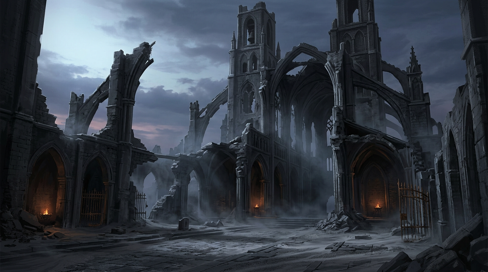 | 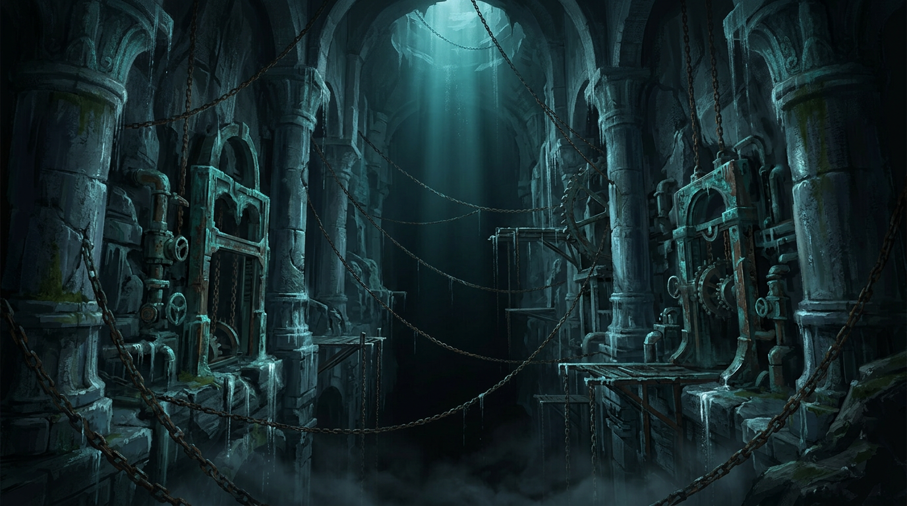 | 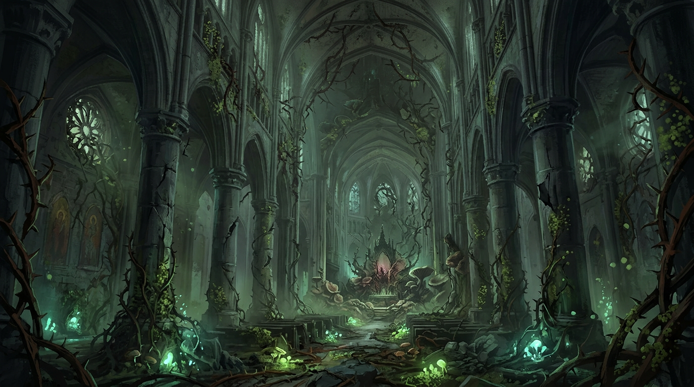 | 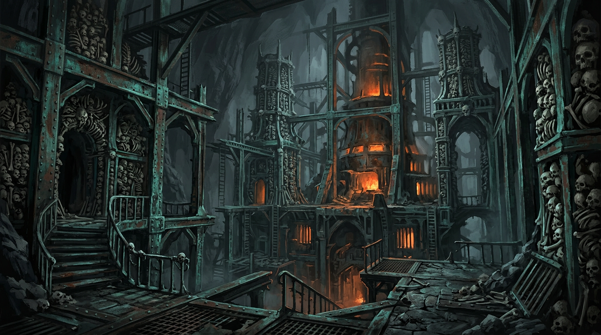 | 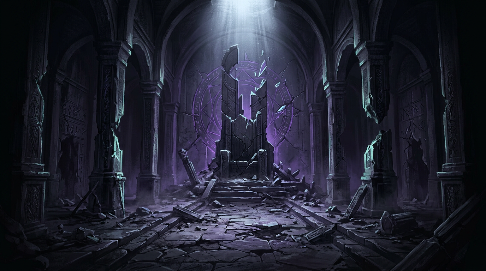 |

*Open originals in `art-bible/concepts/` for full resolution.*

---

## 2) Master Palette

### 2.1 Core Palette (global)

Each row is **token + swatch + hex + role**. Swatches are 64×64 PNG generated from the hex.

| Sample | Token | Hex | Role | Allowed Use |
|:---:|:---|:---|:---|:---|
|  | `AH-INK-0` | `#07090B` | Near-black foundation | Deep voids, screen edge falloff, silhouette backing |
| 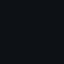 | `AH-INK-1` | `#0D1115` | Primary shadow mass | Cavities, underside planes, occlusion zones |
|  | `AH-ASH-2` | `#1A2127` | Dark midtone | Structural rock and masonry midtones |
|  | `AH-ASH-3` | `#2B343B` | Light midtone | Foreground surface planes, ledge readability |
|  | `AH-BONE-4` | `#4B5A63` | Edge light neutral | Material edges and light-facing bevels |
|  | `AH-FOG-5` | `#7E8E95` | Atmospheric lift | Distant planes and fog blend ramps |
|  | `AH-EMBER-6` | `#A85B32` | Warm danger accent | Fire, fresh hazard edge, active threat states |
|  | `AH-RUST-7` | `#7C3D2B` | Warm grime | Oxidation, blood-rust traces, old damage |
|  | `AH-VERDIGRIS-8` | `#2D6662` | Cool relic accent | Ancient machinery, inactive arcane traces |
|  | `AH-GLINT-9` | `#9FD6C7` | High-value focal accent | Rare pickups, key readability pings, eye guides |
|  | `AH-TOXIC-10` | `#6E8F2E` | Biological hazard accent | Spores, caustic flora, poison reads |
|  | `AH-ROYAL-11` | `#5A4E87` | Ability/ritual signal | Ability shrines, progression rituals |

### 2.2 Palette strip (quick comparison)

           

*Order: neutral ramp → fog → warm accents → cool accents → specials.*

### 2.3 Palette usage limits (enforced)

- Environment tiles: 70–80% from `AH-INK-0` to `AH-BONE-4`.
- Atmosphere layers: 15–25% from `AH-FOG-5` and muted variants.
- Accent budget per screen: 5–10% total, never more than two accent families at once.
- Pure highlight usage (`AH-GLINT-9`) capped to micro-areas: icon centers, spark hits, focal edges.
- Hard ban: introducing untracked one-off colors in production sprites.

### 2.4 Usage matrix (text + pairing samples)

| Visual Need | Primary | Secondary | Never Pair With |
|---|---|---|---|
| Traversable floor readability | `AH-ASH-3` | `AH-BONE-4` | `AH-FOG-5` as main floor value |
| Background depth | `AH-INK-1` | `AH-ASH-2` | `AH-GLINT-9` broad fill |
| Hazard telegraph | `AH-EMBER-6` | `AH-RUST-7` | `AH-VERDIGRIS-8` same asset state |
| Ancient mechanism | `AH-VERDIGRIS-8` | `AH-BONE-4` | `AH-EMBER-6` unless "overheated" variant |
| Ability altar | `AH-ROYAL-11` | `AH-GLINT-9` | `AH-TOXIC-10` |
| Bio-corruption | `AH-TOXIC-10` | `AH-RUST-7` | `AH-ROYAL-11` |

**Figure — primary + secondary pairings (diagrammatic, not in-game ratios):**

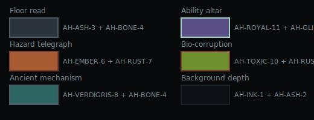

---

## 3) Silhouette differentiation rules

Silhouette must identify class before detail and color.

### 3.1 Universal rules

- Read check scale: evaluate at 1×, 0.75×, and 0.5× capture sizes.
- Unique outer contour priority over interior detail.
- Max one dominant silhouette idea per entity.
- Internal contrast cannot be required to identify entity class.

### 3.2 Player silhouette rules

- Form language: tapered vertical body with asymmetric cloak/cloth break.
- Read anchors: distinct head notch, one leading shoulder mass, and clear foot break.
- Motion identity: forward-lean anticipation and cape tail direction must remain readable in idle/run/jump.
- Prohibited overlap: no enemy class may share player head-to-body ratio or cape profile.

**Sample — player read board:**

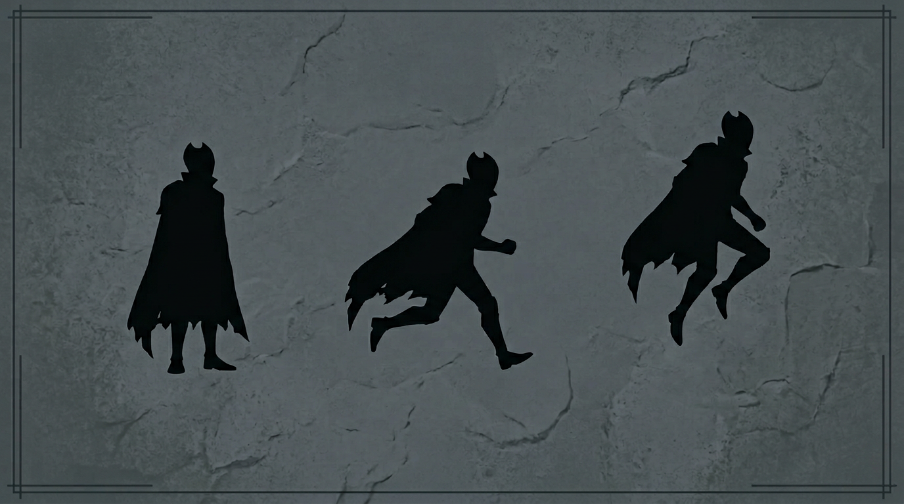

### 3.3 Enemy class silhouette rules

#### Grunt enemies

- Broad lower mass, compressed upper profile.
- Lateral aggression shapes (hooks, spikes, or weapon wings).
- Must contrast player by wider stance and lower center of mass.

#### Agile enemies

- Long diagonal contour; reduced torso mass.
- Read feature must be limb extension or tail line, not face detail.
- Must never mirror player cloak rhythm in run cycle.

#### Heavy / elite enemies

- Top-heavy geometry and stepped armor planes.
- Boxed shoulders, minimal taper.
- At least 1.4× player silhouette area when on same plane.

#### Bosses

- Three read points minimum: crown/mantle, weapon extremity, unique negative-space hole.
- Must remain identifiable in pure black fill against mid-gray background.
- Boss add-ons cannot create player-like profile at any frame.

**Sample — class plate (reference, not final designs):**

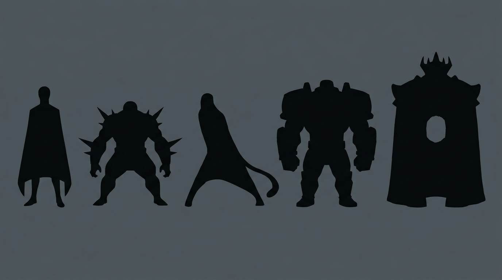

### 3.4 Environment silhouette rules

- Traversable surfaces: long stable horizontals with predictable step cadence.
- Non-traversable decoration: broken contours and interrupted rhythm.
- Hazard silhouettes: sharp repeats (teeth, thorns, hooks), no rounded comfort curves.
- Door/transition silhouette: vertical framing with a distinct top marker to telegraph route logic.

**Figure — schematic environment reads:**

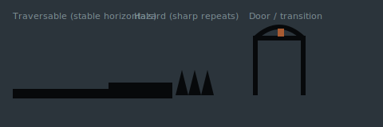

---

## 4) Global lighting and material response

### 4.1 Global light direction

- Key light direction default: upper-left at ~35°.
- Fill: low-intensity cool bounce from lower-right.
- Rim light: reserved for interactables, player, bosses, and key path props.
- Exceptions must be biome-authored and documented; no per-asset arbitrary light direction changes.

**Figure — default lighting model:**

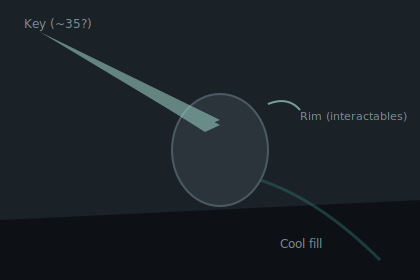

### 4.2 Value hierarchy

- Foreground playable plane: highest local contrast.
- Midground atmosphere: compressed contrast.
- Far background: value-clustered with fog lift.
- Rule: player must never be lower contrast than immediate hazard silhouette.

**Figure — readability stack:**

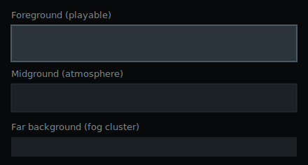

### 4.3 Material response rules

| Material | Highlight behavior | Shadow behavior | Texture rule |
|---|---|---|---|
| Ash stone | Short, matte edge kicks | Broad soft pooling | Medium noise, low spec hits |
| Oxidized metal | Narrow directional glints | Hard terminator with grime bands | Controlled streaking, no mirror shine |
| Dead wood | Broken linear catches | Fibrous dark striations | Grain follows form direction |
| Wet surfaces | Thin high-value line + drip dots | Deep cool sink | Use sparingly for tension rooms |
| Bone/chitin | Waxy mids, clipped highlight tip | Purple-gray core shadows | Segment lines must aid form read |
| Corruption growth | Pulsed emissive nodes | Subsurface dark pockets | Edge glow only on active state |

**Sample — material board (painterly reference under global key light):**

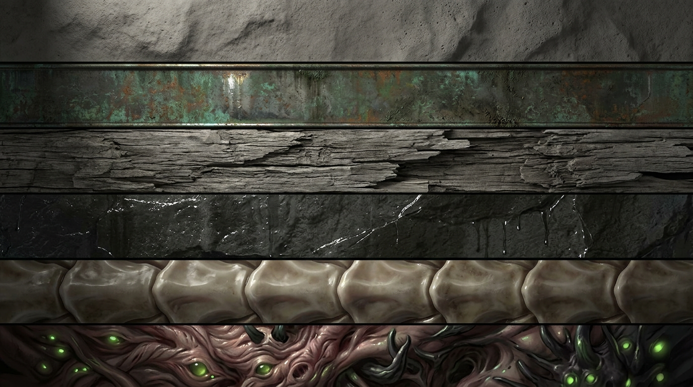

### 4.4 Emissive and FX rules

- Emissive colors allowed: `AH-GLINT-9`, `AH-EMBER-6`, `AH-ROYAL-11`, `AH-TOXIC-10`.
- Emissive occupies ≤ 4% of frame unless a scripted set-piece.
- Particle effects may break palette only for one-frame white core in impact flashes.

**Figure — approved emissive hues:**

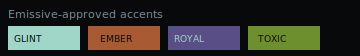

---

## 5) Biome-by-biome visual grammar (foundation set)

Grammar is canonical; display names may change with Narrative / Game Director.

### 5.1 Cinder Approach (entry biome)

- Dominant values: `AH-INK-1`, `AH-ASH-2`, `AH-ASH-3`.
- Accent family: `AH-RUST-7` with sparse `AH-EMBER-6`.
- Shape language: collapsed arches, fractured buttresses, wind-cut flats.
- Lighting mood: low-angle dusk bleed, long shadows, sparse warm brazier pockets.
- Readability mandate: path edges brighter than walls by one value step.

### 5.2 Weeping Vaults (subterranean stone)

- Dominant values: `AH-INK-0`, `AH-INK-1`, `AH-BONE-4`.
- Accent family: `AH-VERDIGRIS-8`.
- Shape language: vertical shafts, hanging roots/chains, drip-fed basins.
- Lighting mood: cold directional shafts with low fog bloom.
- Hazard language: waterline shimmer + spike silhouettes below sightline.

### 5.3 Thorn Reliquary (bio-corrupted zone)

- Dominant values: `AH-ASH-2`, `AH-ASH-3`, `AH-TOXIC-10` (controlled).
- Accent family: `AH-TOXIC-10` + limited `AH-RUST-7`.
- Shape language: invasive overgrowth, barbed radial bursts, tendon bridges.
- Lighting mood: underlit toxicity with intermittent breathing glow.
- Hazard language: repeating thorn cadence; poisonous reads pre-contact.

### 5.4 Iron Ossuary (militant ruin / factory hybrid)

- Dominant values: `AH-INK-1`, `AH-ASH-2`, `AH-BONE-4`.
- Accent family: `AH-VERDIGRIS-8` plus overheated `AH-EMBER-6` states.
- Shape language: riveted beams, pressure doors, bone-stack motifs.
- Lighting mood: directional industrial slashes with furnace punctures.
- Readability mandate: moving machinery contrast must not hide enemy reads.

### 5.5 Hollow Throne (late-game ritual core)

- Dominant values: `AH-INK-0`, `AH-ASH-2`, `AH-ROYAL-11`.
- Accent family: `AH-ROYAL-11` + focal `AH-GLINT-9`.
- Shape language: severe symmetry broken by ritual damage.
- Lighting mood: stark top light with deep vignette wells.
- Encounter framing: bosses centered by negative space and constrained emissive arcs.

---

## 6) Environment, enemy, and player separation rules

- Player always occupies a unique value lane against walkable planes.
- Enemy telegraph colors never overlap interactable objective colors in the same room state.
- Background motifs cannot share silhouette rhythm with active hazards.
- Collectible/read-important objects require one of: hue separation, value halo, or motion contrast.

**Figure — schematic separation (not a room layout):**

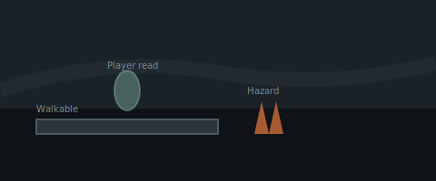

### 6.1 Toolchain vs in-game UI (boundary)

- **In-game HUD, map, and diegetic UI** follow **this bible** (Ashen Hollow world palette and tone).
- **Editor / sprite workbench / OS dashboard chrome** follow **`STYLE_GUIDE.md`** (product cyan accent system). Do not mix the two without intent.

---

## 7) Production quality gate (pass/fail)

Any asset entering the game must pass all checks:

1. Palette compliance: only approved tokens, with biome rules respected.
2. Silhouette class clarity at game scale (quick black-fill test).
3. Lighting consistency with global or documented biome override.
4. Material response matches assigned material family.
5. Visual grammar fit for assigned biome.
6. Gameplay readability: platform/hazard/interactable hierarchy intact.

Failure on any single check = reject for revision.

---

## 8) Implementation notes for PDF export

- Bundle paths under `artifacts/art-bible/` when exporting so relative links resolve.
- Suggested export title: **Ashen Hollow Art Bible Foundation v0.2**.
- Binary PDF in-repo only after explicit founder approval (per v0.1 policy).

---

## 9) Known open decisions for v0.3

- Confirm canonical biome names with Narrative and Game Director.
- Lock player fantasy before final player silhouette variants.
- Approve "danger accent hierarchy" against final combat telegraph standards.
- Decide whether any biome gets a sanctioned secondary accent family.
- Room graph crosswalk: map `R1`–`R10` / branches to biome grammar when layout locks.
