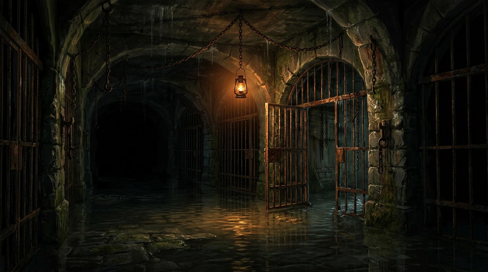
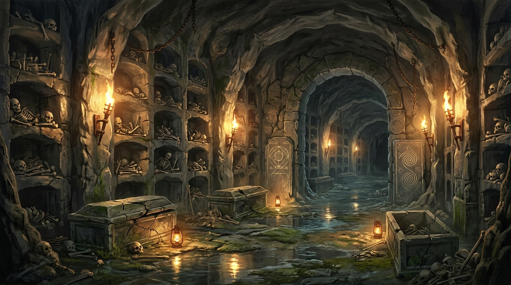
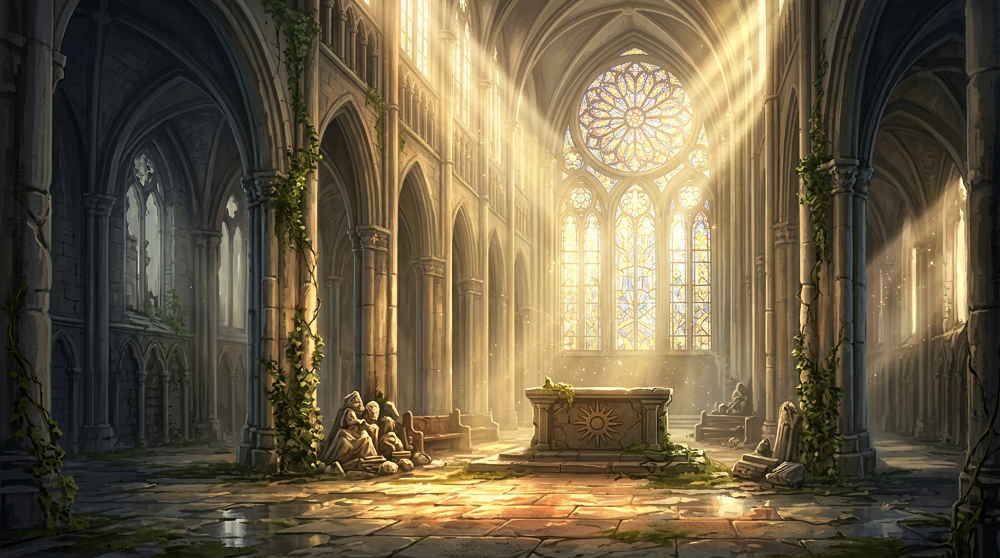
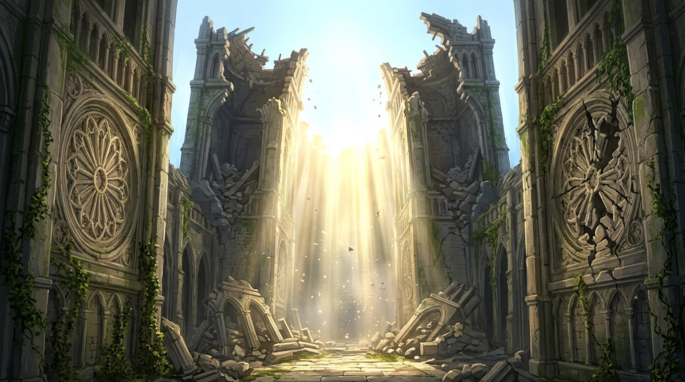
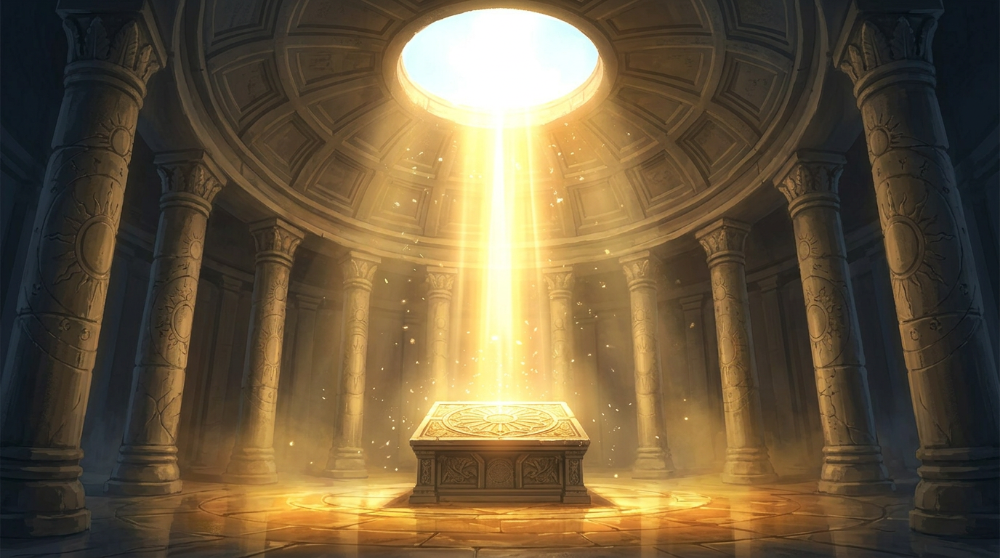
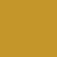

# [GAME TITLE TBD] Art Bible Foundation v0.3 [^title]

[^title]: *"Ashen Hollow" is a confirmed AI-generated placeholder. A dedicated naming session with Narrative and Game Director is required before any public-facing material is produced.*

Version: v0.3.1  
Date: 2026-04-10  
Owner: Creative Agent (with Game Director alignment on progression crosswalks)  
Intent: Single visual contract for production art — **every color rule, diagram, and biome note is paired with an on-page sample** (swatch, figure, or concept plate).

**Supersedes:** v0.2 (`artifacts/ashen-hollow-art-bible-v0.2.md`). v0.3 supersedes v0.2. Biomes, knight identity, world lore, and palette have all changed materially.

**Revision v0.3.1:** Per-biome **wall / platform / border** texture concepts (SVG concept plates); **material response** reorganized — global table is shared vocabulary only; **authoritative environment surfacing** is under each biome in §5. Legacy single material board superseded.

---

## How to use this document

- **Markdown / GitHub:** relative paths below resolve from this file inside `artifacts/`.
- **PDF / Notion export:** bundle the `artifacts/art-bible/` folder next to this file so images resolve, or embed images manually.
- **Regenerate swatches:** `python3 scripts/generate_art_bible_swatches.py` (requires Pillow).
- **Concept plates:** AI-generated mood references — human review before production sprites; same rule as Creative charter.
- **Placeholder names** marked **[PLACEHOLDER]** require founder or Game Director sign-off before public use.

---

## 1) Visual Identity Thesis

[GAME TITLE TBD] is a dark-fantasy metroidvania about a knight of the Order of the Sun — a survivor of a catastrophic plague of darkness — whose goal is to ascend from the deepest darkness back to the light. The world was built by an order devoted to the sun, slowly rotted, and then broke catastrophically. What remains is a ruined civilization whose architecture still carries the memory of light.

The game's central visual contract is a **dark-to-light progression axis**. The knight begins at the lowest, darkest point of the world and ascends toward the sun. As the world grows brighter and more beautiful, enemies grow darker and more grotesque. Three simultaneous arcs reinforce this at all times: the world brightening, the knight's own sun iconography revealing, and the enemies intensifying.

Visual promise to the knight: readable traversal first, atmosphere second, decoration third.

Primary references in spirit (not imitation): Hollow Knight's interconnected world structure and tonal restraint. Blasphemous's icon discipline and religious iconography. Dark Souls' environmental storytelling and tragic lore — specifically Solaire of Astora as the knight archetype. The game departs from Dark Souls in tone and does not copy it directly.

### 1.1 Mood spread (reference)

Five biome mood plates — **biome order = vertical world axis.** Flooded Prison is the lowest point. The Solarium is the apex.

| Flooded Prison | Bone Warrens | Castle Nave | Ruined Belfry | The Solarium |
|---|---|---|---|---|
|  |  |  |  |  |

*Biome order = vertical world axis. Flooded Prison is the lowest point. The Solarium is the apex.*

*Open originals in `art-bible/concepts/` for full resolution.*

---

## 2) Master Palette

### 2.1 Core Palette (global)

Each row is **token + swatch + hex + role**. Swatches are 64×64 PNG generated from the hex.

| Sample | Token | Hex | Role | Allowed Use |
|:---:|:---|:---|:---|:---|
|  | `AH-INK-0` | `#07090B` | Near-black foundation | Deep voids, screen edge falloff, silhouette backing |
|  | `AH-INK-1` | `#0D1115` | Primary shadow mass | Cavities, underside planes, occlusion zones |
|  | `AH-ASH-2` | `#1A2127` | Dark midtone | Structural rock and masonry midtones |
|  | `AH-ASH-3` | `#2B343B` | Light midtone | Foreground surface planes, ledge readability |
|  | `AH-BONE-4` | `#4B5A63` | Edge light neutral | Material edges and light-facing bevels |
|  | `AH-FOG-5` | `#7E8E95` | Atmospheric lift | Distant planes and fog blend ramps |
|  | `AH-EMBER-6` | `#A85B32` | Warm danger accent | Fire, fresh hazard edge, active threat states |
|  | `AH-RUST-7` | `#7C3D2B` | Warm grime | Oxidation, blood-rust traces, old damage |
|  | `AH-VERDIGRIS-8` | `#2D6662` | Cool relic accent | Ancient machinery, inactive arcane traces |
|  | `AH-GLINT-9` | `#9FD6C7` | High-value focal accent | Rare pickups, key readability pings, eye guides |
|  | `AH-TOXIC-10` | `#6E8F2E` | Biological hazard accent | Spores, caustic flora, poison reads |
|  | `AH-ROYAL-11` | `#5A4E87` | Ability/ritual signal | Ability shrines, progression rituals |
|  | `AH-SOLAR` | `#C4962A` | Player sun iconography + endgame world light | Knight tabard sun emblem (all reveal states), Ruined Belfry sun accent, The Solarium dominant. **Never used for hazards or enemies.** |
|  | `AH-ARCANE` | `#3A7BD5` | Mystical/rune accent | Bone Warrens rune glow, magical interactive elements. Never used for sky or water. |
|  | `AH-SKY` | `#7EB8D4` | Open sky atmosphere | Ruined Belfry sky. Never used underground. |

*Swatch PNGs generated via `scripts/generate_art_bible_swatches.py` — confirm hex values with founder at swatch review.*

### 2.2 Palette strip (quick comparison)

              

*Order: neutral ramp → fog → warm accents → cool accents → specials → solar / arcane / sky.*

### 2.3 Palette usage limits (enforced)

- Environment tiles: 70–80% from `AH-INK-0` to `AH-BONE-4`.
- Atmosphere layers: 15–25% from `AH-FOG-5` and muted variants.
- Accent budget per screen: 5–10% total, never more than two accent families at once.
- Pure highlight usage (`AH-GLINT-9`) capped to micro-areas: icon centers, spark hits, focal edges.
- Hard ban: introducing untracked one-off colors in production sprites.
- `AH-SOLAR` is **reserved** for the knight's sun iconography and the endgame world palette. It must not appear on enemies, hazards, or non-Order architecture except as a faded/worn trace indicating pre-fall Order presence.

### 2.4 Usage matrix (text + pairing samples)

| Visual Need | Primary | Secondary | Never Pair With |
|---|---|---|---|
| Traversable floor readability | `AH-ASH-3` | `AH-BONE-4` | `AH-FOG-5` as main floor value |
| Background depth | `AH-INK-1` | `AH-ASH-2` | `AH-GLINT-9` broad fill |
| Hazard telegraph | `AH-EMBER-6` | `AH-RUST-7` | `AH-VERDIGRIS-8` same asset state |
| Ancient mechanism | `AH-VERDIGRIS-8` | `AH-BONE-4` | `AH-EMBER-6` unless "overheated" variant |
| Ability altar | `AH-ROYAL-11` | `AH-GLINT-9` | `AH-TOXIC-10` |
| Bio-corruption | `AH-TOXIC-10` | `AH-RUST-7` | `AH-ROYAL-11` |
| Knight sun iconography | `AH-SOLAR` | `AH-GLINT-9` | Any enemy or hazard token |
| Open sky (Ruined Belfry) | `AH-SKY` | `AH-SOLAR` | `AH-ARCANE` |
| Mystical rune glow | `AH-ARCANE` | `AH-BONE-4` | `AH-TOXIC-10`, `AH-EMBER-6` |
| Castle Nave stained glass | Spectrum exception — see Biome 3 — Castle Nave | — | Must be contained to windows and book spines only |

**Figure — primary + secondary pairings (diagrammatic, not in-game ratios):**

---

## 3) Silhouette differentiation rules

Silhouette must identify class before detail and color.

### 3.1 Universal rules

- Read check scale: evaluate at 1×, 0.75×, and 0.5× capture sizes.
- Unique outer contour priority over interior detail.
- Max one dominant silhouette idea per entity.
- Internal contrast cannot be required to identify entity class.

### 3.2 Knight — Order of the Sun (playable character)

The knight is a knight of the Order of the Sun. Their identity is defined by:

- **Armour form:** Structured knightly plate armour. Broader shoulder plates, disciplined geometry. Not a flowing wraith — a trained warrior. Presence and weight communicated through proportion.
- **Tabard:** A cloth tabard worn over the armour, bearing the Order's sun emblem. This is the primary canvas for the visual progression arc (see §3.2.1).
- **Sun iconography:** Eight-pointed sun wheel, radiating rays. Present on the tabard, optionally echoed on shoulder plates and helmet.
- **Movement identity:** Fast and precise — the armour does not slow them. Quick acceleration, sharp stops. Weight lives in combat actions (attacks, landings after falls), not traversal.
- **Silhouette anchors:** Distinct helmet profile, structured shoulder mass, tabard break at the hip, clear foot plant.
- **Prohibited overlap:** No enemy class may share the structured shoulder-to-hip ratio or the tabard cloth break.

#### 3.2.1 Knight visual progression arc — THREE STATES

This is a core art bible rule. The knight has three distinct visual states that must be designed, documented, and respected across all art.

**State 1 — Hidden (game start, Flooded Prison and Bone Warrens)**

- Sun iconography on tabard is concealed or illegible — covered in grime, darkness, or deliberate obscurement.
- Tabard is dark, worn, heavily weathered. The Order's colours are not visible.
- The knight reads as an anonymous armoured figure. The sun is a secret they carry.
- `AH-SOLAR`: not present on the knight.

**State 2 — Emerging (mid-game, Castle Nave and Ruined Belfry)**

- Tabard begins showing its original colour. Sun emblem partially visible — the grime and damage clearing.
- The sun iconography is there if you look, but not yet blazing.
- `AH-SOLAR`: appears at low opacity on tabard emblem only.

**State 3 — Revealed (endgame, The Solarium)**

- Tabard fully restored. Sun emblem clear, vivid, blazing.
- The knight is visibly a figure of light. The iconography reads instantly.
- `AH-SOLAR`: full strength on tabard and optionally armour edge details.

**Crosswalk requirement:** The specific narrative/progression triggers for each state transition must be defined by the Game Director before knight sprite production begins. See `game-director-status.json` priority #3.

**Sample — pre-v0.3 silhouette reference plate (replace with Order knight production boards):**

### 3.3 Enemy class silhouette rules

#### Grunt enemies

- Broad lower mass, compressed upper profile.
- Lateral aggression shapes (hooks, spikes, or weapon wings).
- Must contrast the knight by wider stance and lower center of mass.

#### Agile enemies

- Long diagonal contour; reduced torso mass.
- Read feature must be limb extension or tail line, not face detail.
- Must never mirror knight tabard rhythm in run cycle.

#### Heavy / elite enemies

- Top-heavy geometry and stepped armor planes.
- Boxed shoulders, minimal taper.
- At least 1.4× knight silhouette area when on same plane.

#### Bosses

- Three read points minimum: crown/mantle, weapon extremity, unique negative-space hole.
- Must remain identifiable in pure black fill against mid-gray background.
- Boss add-ons cannot create knight-like profile at any frame.

**Sample — class plate (reference, not final designs):**

### 3.4 Environment silhouette rules

- Traversable surfaces: long stable horizontals with predictable step cadence.
- Non-traversable decoration: broken contours and interrupted rhythm.
- Hazard silhouettes: sharp repeats (teeth, thorns, hooks), no rounded comfort curves.
- Door/transition silhouette: vertical framing with a distinct top marker to telegraph route logic.

**Figure — schematic environment reads:**

---

## 4) Global lighting and material response

### 4.1 Global light direction

- Key light direction default: upper-left at ~35°.
- Fill: low-intensity cool bounce from lower-right.
- Rim light: reserved for interactables, knight, bosses, and key path props.
- Exceptions must be biome-authored and documented; no per-asset arbitrary light direction changes.

**Figure — default lighting model:**

#### 4.1.1 World light progression

The game's light temperature and intensity follow the vertical world axis:

- **Flooded Prison:** Amber lantern only. No golden-white present. The only warmth is the single hanging lantern. The rest of the space is cold and dark.
- **Bone Warrens:** Multiple warm torch sources. First traces of golden-white beginning to appear. `AH-ARCANE` blue from mystical elements provides cool contrast.
- **Castle Nave:** Golden-white sunlight dominant, entering through stained glass windows in dramatic shafts. The most colourful biome in the game — stained glass spectrum permitted on windows and book spines only.
- **Ruined Belfry:** Full outdoor golden-white, sky blue present. The sun is physically present and dominant. `AH-SOLAR` and `AH-SKY` are the primary accent family here.
- **The Solarium:** Monotone golden-white. The only colour family is the solar spectrum. No accent diversity — the simplicity is intentional and earned.

**Rule:** each biome must read as lighter than the one below it on the vertical axis.

### 4.2 Value hierarchy

- Foreground playable plane: highest local contrast.
- Midground atmosphere: compressed contrast.
- Far background: value-clustered with fog lift.
- Rule: the knight must never be lower contrast than immediate hazard silhouette.

**Figure — readability stack:**

### 4.3 Shared material vocabulary (global)

These **material families** describe how light behaves on surfaces. They are **not** biome-exclusive — any biome may use a family when the story reads true. **Which families dominate walls, platforms, and borders** — and how tile art is built — is **defined per biome in §5** (Wall & platform texture concept). Environment artists should **not** rely on this table alone for tileable texture direction; **always pair** with the biome’s §5 plate and mood concept.

| Material | Highlight behavior | Shadow behavior | Texture rule |
|---|---|---|---|
| Ash stone | Short, matte edge kicks | Broad soft pooling | Medium noise, low spec hits |
| Oxidized metal | Narrow directional glints | Hard terminator with grime bands | Controlled streaking, no mirror shine |
| Dead wood | Broken linear catches | Fibrous dark striations | Grain follows form direction |
| Wet surfaces | Thin high-value line + drip dots | Deep cool sink | Use sparingly for tension rooms |
| Bone/chitin | Waxy mids, clipped highlight tip | Purple-gray core shadows | Segment lines must aid form read |
| Corruption growth | Pulsed emissive nodes | Subsurface dark pockets | Edge glow only on active state |

**Legacy reference (single combined board):**  
`art-bible/concepts/ashen-hollow-material-response-board.png` — **superseded** for production layout by **per-biome** wall/platform plates in §5.

### 4.4 Emissive and FX rules

- Emissive colors allowed: `AH-GLINT-9`, `AH-EMBER-6`, `AH-ROYAL-11`, `AH-TOXIC-10`.
- Emissive occupies ≤ 4% of frame unless a scripted set-piece.
- Particle effects may break palette only for one-frame white core in impact flashes.

**Figure — approved emissive hues:**

---

## 5) Biome-by-biome visual grammar (foundation set)

> Biome names are working production names. The game title is **[PLACEHOLDER]** — see global note. Biome names are not confirmed for public use until the game title is locked.
>
> Biome order follows the **vertical world axis** — Flooded Prison is the lowest, darkest point. The Solarium is the apex. The knight generally ascends through this order in a Hollow Knight-style interconnected structure (non-linear with backtracking, but with a clear upward direction of progression).

#### Biome 1 — Flooded Prison *(start / lowest point)*

- **Dominant values:** `AH-INK-0`, `AH-INK-1`, `AH-ASH-2`
- **Light source:** Single amber lantern only. No sunlight. No golden-white.
- **Accent family:** Mossy green — `AH-TOXIC-10` at low opacity on stone surfaces, waterline, and cell walls. Reads as organic decay, not hazard.
- **Shape language:** Stone arched corridors, rusted iron bar cells, hanging chains, flooded floor with water reflection, icicle drips from ceiling.
- **Lighting mood:** Near-total darkness punctuated by one amber lantern. The lantern reflection on the water is the primary light read.
- **Environmental storytelling:** This is the Order's old prison — cells still locked, some open. Evidence of the slow rot: moss, water ingress, structural failure over decades before the catastrophic break.
- **Hazard language:** Water depth unknown, cell bars blocking path, chain obstacles.
- **Readability mandate:** The lantern must be the visual anchor of every room. Knight silhouette reads against the lantern glow.

**Wall & platform texture concept**

- **Wall:** Wet ash masonry (`AH-INK` → `AH-ASH` ramps); vertical water-stain read; moss `AH-TOXIC-10` only as low-opacity organic film — not hazard green.
- **Platform / traversable:** Dark cap stone with **wet edge** (thin highlight line + deeper contact shadow); tileable horizontal repeat; no specular “pool shine” on walkable center.
- **Border / trim:** Rusted iron cell bars and frames — `AH-RUST-7` grime, `AH-EMBER-6` only on active heat; vertical rhythm for **border** vs **platform** silhouette separation.

---

#### Biome 2 — Bone Warrens *(low-mid)*

- **Dominant values:** `AH-INK-1`, `AH-ASH-2`, `AH-ASH-3`
- **Light sources:** Wall-mounted torches (warm amber), floor lanterns. Multiple sources — more light than Flooded Prison.
- **Accent family:** `AH-ARCANE` (mystical blue) for rune glyphs, magical interactive elements, and arcane residue on stone. Subtle — never dominant.
- **Secondary accent:** Torch warm (`AH-EMBER-6` for active flame only).
- **Shape language:** Natural cave rock carved into burial niches stacked floor to ceiling, filled with bones and skulls. Stone sarcophagi on the ground. Stalactites. Water traces on the floor (connects visually to Flooded Prison below).
- **Lighting mood:** Warmer and more present than Flooded Prison but still largely dark. The `AH-ARCANE` blue provides cool contrast against the torch warmth.
- **Environmental storytelling:** The Order's burial warrens. Their dead are here. The arcane rune glyphs are Order funerary markings, not enemy markings. The Deep's influence is present but the Order's identity is still legible.
- **Rune/glyph rule:** Arcane glyphs are geometric symbols only — no legible text or letters. `AH-ARCANE` glow, never `AH-ROYAL-11`.
- **Hazard language:** Bone-collapse platforms, confined cave passages, ceiling stalactite drops.

**Wall & platform texture concept**

- **Wall:** Carved cave stone with **burial niche** rhythm; subtle bone-chip / void noise; funerary `AH-ARCANE` geometry **etched** into stone, never painted UI-green.
- **Platform / traversable:** Burial slab / rough floor tile — cooler than torch walls; cracks read as **readability** not decoration clutter.
- **Border / trim:** Niche arch and passage **border** uses `AH-ARCANE` line weight at low opacity; torch warmth `AH-EMBER-6` on **edge** only.

---

#### Biome 3 — Castle Nave *(mid / major transition)*

- **Dominant values:** `AH-ASH-2`, `AH-ASH-3`, `AH-BONE-4` (significantly lighter than biomes 1–2)
- **Light sources:** Golden-white sunlight through stained glass windows — the first real sunlight in the game. Dramatic shaft lighting across stone floors.
- **Accent family — stained glass exception:** This is the only biome permitted a spectrum of colours beyond the palette. Stained glass windows and book spines on shelves may use a controlled range of muted jewel tones. These colours are **contained to windows and book spines only** — never on structural surfaces, enemies, or props.
- **Secondary accent:** Bright green ivy/vines (`AH-TOXIC-10` at higher saturation than Flooded Prison — here it reads as life, not decay). Climbing pillars and walls.
- **Shape language:** Gothic cathedral nave, massive pointed arch windows, tall stone pillars, winding castle corridors leading up to the nave, bookshelves lining lower corridor walls, stone floors with golden light pools.
- **Lighting mood:** The most visually complex biome. Golden-white shafts are the dominant light, coloured by stained glass as they pass through. The space is warm and grand despite its ruin.
- **Environmental storytelling:** The Order's great library and cathedral. Bookshelves with varied spines tell of a civilization of knowledge. The cathedral nave is the Order's primary worship space — the sun wheel altar is here. This is the major boss arena.
- **Boss arena note:** The cathedral nave at the end of this biome is a designed boss encounter space. The golden-white light and sun wheel altar are the visual frame for that encounter.
- **Readability mandate:** Boss must remain readable against the complex stained glass backdrop. Enemy silhouette value must contrast the lit floor plane.

**Wall & platform texture concept**

- **Wall:** Dressed Gothic ash — **vertical rib** read; lighter than Flooded Prison; ivy `AH-TOXIC-10` reads as **life** (higher saturation than biome 1 moss).
- **Platform / traversable:** Large nave flagstone — **sun shaft pool** on floor plane (warm lift on `AH-BONE-4` / `AH-ASH-3`); borders stay in palette (no jewel tones on floor).
- **Border / trim:** Moulding / shelf / lead-line **border** only; structural stone stays on `AH-*` neutrals — no stained glass on walls or platforms.

---

#### Biome 4 — Ruined Belfry *(high-mid / first outdoor)*

- **Dominant values:** `AH-ASH-3`, `AH-BONE-4`, `AH-FOG-5` (significantly lighter — first outdoor biome)
- **Light source:** Direct golden-white sunlight from above. Outdoor, no ceiling. The sun is physically present for the first time.
- **Primary accent family:** `AH-SOLAR` (sun gold) dominant. `AH-SKY` (open sky blue) for sky atmosphere and background.
- **Shape language:** Two massive gothic stone towers with catastrophically shattered tops, broken open to the sky. Rose window carvings on tower faces — one intact, one shattered. Fallen arches and rubble below. Ivy and green growth on stone. Debris floating in golden light.
- **Lighting mood:** Overwhelming after the darkness below. Ethereal — light rays visible, dust particles in sunlight. The golden-white is at its strongest outdoor intensity here.
- **Environmental storytelling:** The Order's belfry — its towers were the highest point of the complex. The catastrophic break shattered the tops and opened them to the sky. The sun wheel carvings on the towers are the Order's identity made architectural. One intact, one shattered = the state of the Order itself.
- **Knight state:** The knight's tabard should be in State 2 (Emerging) by this biome — the sun emblem partially visible. The visual echo between the knight's emerging iconography and the carved sun wheels on the towers is intentional.
- **Hazard language:** Exposed high platforms, wind-pushed traversal, falling debris from broken stonework.

**Wall & platform texture concept**

- **Wall:** Sun-bleached tower ash — **stronger value lift** than underground; `AH-SOLAR` warm wash on planes facing sky; `AH-SKY` reserved for **atmospheric** band, not wall base.
- **Platform / traversable:** Outdoor ledge / capstone — **horizontal** grain; ivy life read on outer edges; border must not read as interior dungeon tile.
- **Border / trim:** Broken parapet / shattered rose-window **frame** — stone + `AH-SOLAR` accent; **no** `AH-ARCANE` (outdoor / solar order).

---

#### Biome 5 — The Solarium *(apex / endgame)*

- **Dominant values:** `AH-BONE-4`, `AH-FOG-5`, and `AH-SOLAR` — the lightest value range in the game.
- **Light source:** Single central oculus in the dome ceiling, pouring a column of golden-white light directly onto the altar. The most intense and pure light in the game.
- **Accent family:** Monotone solar. `AH-SOLAR` only. No secondary accent family — the restraint is deliberate and earned. This biome has one colour and it is the sun.
- **Shape language:** Circular solar temple. Grand stone columns in a ring around a central altar. Dome ceiling with oculus. Sun wheel altar at center, directly under the light shaft. Stone floor catching the light warmly.
- **Lighting mood:** Sacred stillness. Triumphant. After five biomes of darkness and ascent, the light is total and unchallenged here. The edges of the space fade to shadow but the centre is brilliantly lit.
- **Environmental storytelling:** The Order's highest sanctuary — the room built to be closest to the sun. It was never destroyed, never corrupted. The Deep never reached here. This is what the Order was building toward.
- **Knight state:** The knight's tabard must be in State 3 (Revealed) here — the sun emblem blazing. The knight is visually completing the same arc as the world.
- **No enemies in concept art:** The Solarium concept plate shows no enemies deliberately. Enemy design for this biome will be specified separately.
- **Boss note:** The final boss encounter with the being behind The Deep **[PLACEHOLDER]** occurs here. Their design must be specified separately and must earn the tragedy established in the world lore. See §9 open decisions.

**Wall & platform texture concept**

- **Wall:** Column ring **monotone** — `AH-SOLAR` + neutrals only; smooth, ceremonial; **no** moss, arcane blue, or toxic green.
- **Platform / traversable:** Floor under **oculus** — brightest pool in the game; radial falloff from center; **no** competing accent tiles.
- **Border / trim:** Sun wheel **frieze** / altar border — `AH-SOLAR` line work; edges fade to `AH-INK` shadow at dome perimeter.

---

## 6) Environment, enemy, and knight separation rules; enemy factions

### 6.1 Environment, enemy, and knight separation

- The knight always occupies a unique value lane against walkable planes.
- Enemy telegraph colors never overlap interactable objective colors in the same room state.
- Background motifs cannot share silhouette rhythm with active hazards.
- Collectible/read-important objects require one of: hue separation, value halo, or motion contrast.

**Figure — schematic separation (not a room layout):**

#### 6.1.1 Toolchain vs in-game UI (boundary)

- **In-game HUD, map, and diegetic UI** follow **this bible** ([GAME TITLE TBD] world palette and tone).
- **Editor / sprite workbench / OS dashboard chrome** follow **`STYLE_GUIDE.md`** (product cyan accent system). Do not mix the two without intent.

### 6.2 Enemy factions

The world's enemies belong to two distinct visual tiers:

#### Tier 1 — [The Sunken] **[PLACEHOLDER NAME]**

Former inhabitants of the world, claimed by The Deep **[PLACEHOLDER NAME]**. These were people, creatures, or constructs before the darkness took them.

- **Visual identity:** Corrupted versions of what they were. Biome-specific — each biome's Sunken look different because they were different things before.
- **Design rule:** Their original identity must still be legible beneath the corruption. You should be able to read what they were.
- **Color:** The Deep's darkness has drained their colour. Low saturation, heavy `AH-INK` values, corruption traces in `AH-TOXIC-10` or `AH-RUST-7`.
- **Animation:** Low-frame expressionist (4–8 frames). Movement feels wrong — snappy, unpredictable, broken. The corruption shows in how they move.
- **Distribution:** Biome-specific. They do not cross biomes except where the narrative requires it.

#### Tier 2 — [The Servants] **[PLACEHOLDER NAME]**

Rare, powerful entities deliberately shaped by the being behind The Deep. Almost mythical — encountered as side bosses, not common enemies.

- **Visual identity:** Grander than the Sunken. They carry the being's visual language more directly — ancient, sorrowful, intentional. Traces of what they were before the being's influence should be buried in their design.
- **Design rule:** They must read as tragic, not purely evil. They were something else before.
- **Color:** Deeper darkness than the Sunken. `AH-INK-0` dominant with selective `AH-ROYAL-11` traces — they carry something of the ritual/arcane.
- **Animation:** Grand held frames with explosive transitions. Slow and still, then sudden. Makes them feel mythical.
- **Distribution:** Cross-biome. Their appearance in a biome is an event, not a standard encounter.

#### Boss tier — The Final Form

The being behind The Deep **[PLACEHOLDER]** appears in physical form only in The Solarium. Design deferred — must be specified separately and must synthesise all presence language established across the five biomes. The tragedy must be visible in the form.

**Additional separation rules (enemy tiers):**

- Tier 1 enemies (Sunken) get progressively darker and more grotesque as the knight ascends — in direct visual contrast to the brightening world.
- Tier 2 enemies (Servants) carry a consistent visual language regardless of biome.
- Neither tier may use `AH-SOLAR` in any state.

---

## 7) Animation and motion language

### 7.1 Frame count philosophy

| Entity type | Frame count | Rationale |
|---|---|---|
| Knight (playable) | 8–12 frames | Premium treatment. The tabard and sun iconography must read clearly at speed. Cloth animation must remain legible during fast movement. |
| Tier 1 enemies (Sunken) | 4–8 frames | Corruption reads in the wrongness of movement. Low-frame achieves this naturally. |
| Late-game powerful enemies | Lowest frame count deliberately | The most powerful enemies feel the most unsettling in motion — jerky, too-still between bursts. |
| Tier 2 enemies (Servants) | Grand held frames + explosive transitions | Slow and still, then sudden. Mythical and dangerous. |

### 7.2 Physics and movement feel

**Knight movement:** Fast and responsive base. Quick acceleration, sharp stops, responsive jumps. The armour does not slow them — they are a trained warrior.

**Weight lives in combat only:**

- Attack actions carry commitment frames.
- Heavy hits have recovery.
- Landings after normal jumps: quick, single impact frame.
- Landings after long falls: weighted recovery.

**Dodge/evade:** Fast and crisp. The contrast between weighted combat and sharp evasion makes both feel better.

**Cloth/tabard animation rule:** The tabard must remain readable at full movement speed. Cloth animation cannot obscure the sun iconography in State 2 or State 3.

### 7.3 Easing and timing conventions

- Base movement transitions: snappy easing (ease-out, short duration)
- Combat attacks: ease-in to commitment frame, hard stop at impact
- Enemy Sunken movement: irregular timing, no smooth easing — the wrongness is the point
- Servant movement: extremely slow ease-in to held pose, instantaneous explosive release

---

## 8) Production quality gate (pass/fail)

Any asset entering the game must pass all checks:

1. Palette compliance: only approved tokens, with biome rules respected.
2. Silhouette class clarity at game scale (quick black-fill test).
3. Lighting consistency with global or documented biome override.
4. Material response matches assigned material family.
5. Visual grammar fit for assigned biome.
6. Gameplay readability: platform/hazard/interactable hierarchy intact.
7. Knight visual state consistency: knight art must match the correct progression state (Hidden / Emerging / Revealed) for the biome it depicts.
8. Enemy darkness gradient: enemies in later biomes must read darker and more grotesque than equivalent enemies in earlier biomes.

Failure on any single check = reject for revision.

---

## 9) Known open decisions for v0.4

### Placeholder names requiring founder decision:

- **Game title** — "Ashen Hollow" is confirmed placeholder. Dedicated naming session required.
- **The Deep** — working name for the antagonist darkness force. Placeholder.
- **The Sunken** — working name for Tier 1 enemies. Placeholder.
- **The Servants** — working name for Tier 2 enemies. Placeholder.
- **The being behind The Deep** — no name yet. Requires narrative development.

### Design decisions pending Game Director:

- Knight visual state transition triggers — which narrative/progression event activates each state (Hidden → Emerging → Revealed). See `game-director-status.json` priority #3.
- Final boss visual design — deferred until lore and narrative are further developed.

### Art decisions deferred to v0.4:

- Confirm `AH-SOLAR`, `AH-ARCANE`, `AH-SKY` hex values with swatch review.
- Specify enemy design per biome for Tier 1 (Sunken).
- Specify Tier 2 (Servant) encounter design — visual language and encounter framing rules.
- Castle Nave stained glass spectrum — define the permitted jewel tone range explicitly.
- Room graph crosswalk — map biomes to room layout editor once level design locks.
- Biome names confirmed for public use pending game title lock.
- **Optional:** Replace SVG biome wall/platform plates (`biome-0N-walls-platforms.svg`) with **raster texture** tiles (hand or AI + human review) at production resolution — SVGs are structural concepts only.

---

## 10) Implementation notes for PDF export

- Bundle paths under `artifacts/art-bible/` when exporting so relative links resolve.
- Suggested export title: **[GAME TITLE TBD] Art Bible Foundation v0.3** (use locked title when available).
- Binary PDF in-repo only after explicit founder approval (per v0.1 policy).
