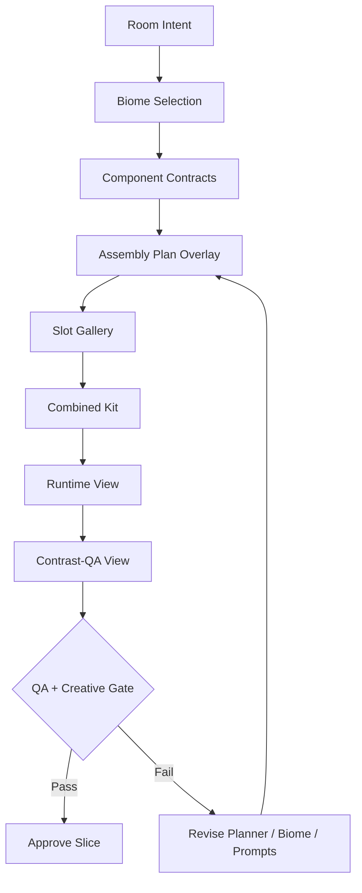

# Room Environment V3 Review Summary

**Date:** 2026-04-01
**Audience:** Founder
**Prepared by:** Level Design after Engineering, QA, Creative, Design, and Game Director review
**Source spec:** [docs/room-environment-pipeline-v3-spec.md](/Users/timwood/Desktop/projects/PWA/MV/docs/room-environment-pipeline-v3-spec.md)

## Executive Summary

The current room environment pipeline is not failing because Gemini is weak. It is failing because the code and process around Gemini are too loose.

Today the system simplifies rooms too aggressively, treats biomes mostly like flavor text, and asks the model for too much in one step. That creates art that can look interesting in isolation but still does not read correctly as a wall, floor, platform, door, or room shell.

The proposed v3 pipeline keeps Gemini and the schema-plus-template approach, but changes the rest of the pipeline so the model is working inside tighter production rules.

## What Changes In Plain English

1. The room layout becomes the boss.
   The pipeline must plan against the real room geometry, including doors, major platforms, pits, ceiling shape, and traversal routes.

2. Biomes become real data.
   Each biome gets explicit visual rules, identity checks, and canonical style anchors so rooms in the same biome feel related without becoming copies.

3. Structural and scenic art are separated.
   Walls, floors, ceilings, platforms, and thresholds must read clearly on their own. Atmosphere and decoration can support them, but cannot replace them.

4. Gemini works slot by slot.
   Instead of one oversized prompt trying to invent the whole room kit at once, the system will generate narrower outputs for known component types.

5. Human review becomes a real gate.
   QA and Creative review screenshots from the actual workflow and runtime, mark blockers, and repeat this loop several times before signoff.

## Main Problems Found In The Current Pipeline

- Rooms are reduced too aggressively before generation, so the output does not match real traversal structure.
- Biomes are not meaningfully selected per room, so results drift toward one shared look.
- Prompting is too monolithic, and fallback logic hides model weaknesses instead of fixing them.
- The workflow does not strongly protect component-fit, which is why some outputs look nice but fail their gameplay role.
- Runtime review is too weak on its own and must be backed by manual screenshot review.

## Reviewed Workflow

This diagram follows the fixed review-surface order requested in the Design review.



## Proposed V3 Pipeline

```text
Art direction lock
  -> biome definition
  -> room assembly plan
  -> slot generation
  -> runtime review
  -> QA + Creative screenshot review
  -> approval or iteration
```

## Key Changes To Approve

- Add explicit biome definitions with identity checklists, forbidden motifs, and canonical style anchors.
- Split the room environment spec into room intent, component contracts, assembly plan, and review state.
- Add room role and progression context so planning reflects how the room is used in the game.
- Keep biome, palette, and environment application proposal-first until a user accepts them.
- Make assembly-plan visibility and runtime-first review mandatory.
- Add QA blocker criteria and Creative rejection codes.
- Start with one biome and three rooms for calibration before broader rollout.

## Additional Issues Pulled Into This Pass

From adjacent planning work, the review also pulled in:

- cross-room style drift within a biome
- missing canonical biome anchors
- proposal-only biome and palette application
- progression-aware room planning

## Outcome Of Stakeholder Review

- Engineering: supports v3, but wants clear schema/versioning and module boundaries before coding.
- QA: supports v3, but wants explicit blocker criteria, fixed fixtures, and runtime-first evidence.
- Creative: supports v3, but wants stronger biome identity rules and rejection criteria for component-fit failures.
- Design: supports v3, but wants proposal-first theming and a fixed review-surface order.
- Game Director: supports v3, but wants room role and progression context added to planning.

## Founder-Level Decision

The recommendation is to treat this as a pipeline rewrite, not another prompt-tuning pass.

The safest path is a narrow first slice:

- one biome
- three fixture rooms
- repeated QA and Creative review rounds
- no silent biome or palette application

- Recommendation: Approve the v3 rewrite direction and use the updated spec as the source of truth for the first implementation slice.
- Risks: Scope can expand quickly if schema boundaries, fixture scope, and review gates are not enforced tightly.
- Confidence: High because the findings were consistent across Engineering, QA, Creative, Design, and Game Director review.
- Founder approval needed: Yes — approve the v3 rewrite direction, the one-biome/three-room first slice, and formal QA plus Creative review gates.
- Next actions: Break Phase 1 and Phase 2 into implementation tasks, lock the calibration fixtures, and begin schema/planner replacement before slot-generation changes.
