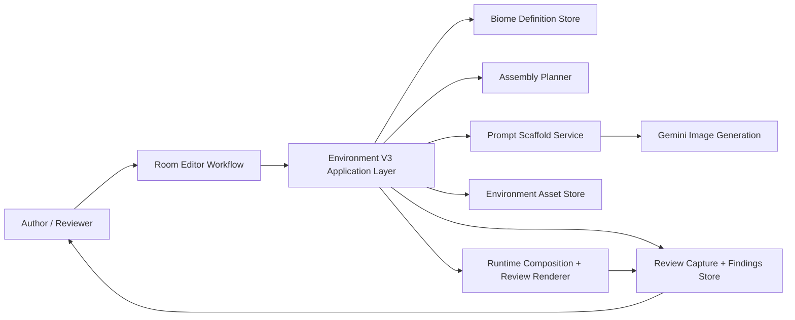
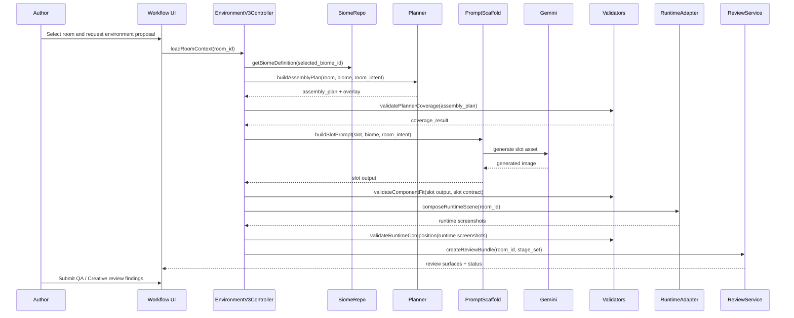
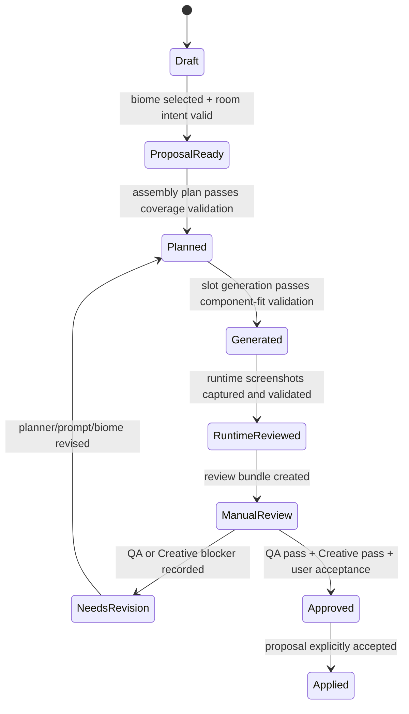
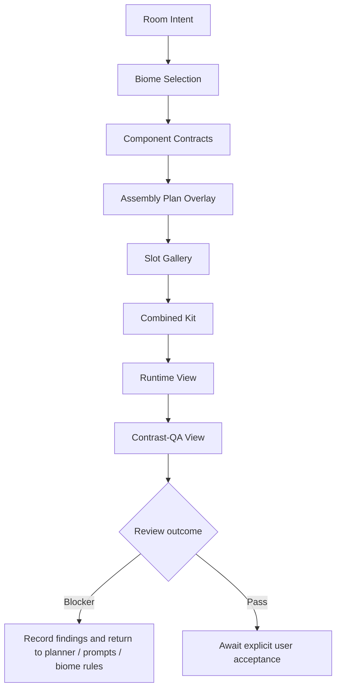

# Room Environment Pipeline V3 Software Requirements

**Date:** 2026-04-01
**Status:** Proposed for implementation planning
**Owners:** Development, Level Design, Design, QA, Creative
**Supersedes:** [docs/room-environment-pipeline-v3-spec.md](/Users/timwood/Desktop/projects/PWA/MV/docs/room-environment-pipeline-v3-spec.md) as the implementation contract
**Related reviews:**
- [docs/reports/room-environment-v3-engineering-review-2026-04-01.md](/Users/timwood/Desktop/projects/PWA/MV/docs/reports/room-environment-v3-engineering-review-2026-04-01.md)
- [docs/reports/room-environment-v3-design-review-2026-04-01.md](/Users/timwood/Desktop/projects/PWA/MV/docs/reports/room-environment-v3-design-review-2026-04-01.md)
- [docs/reports/room-environment-v3-qa-review-2026-04-01.md](/Users/timwood/Desktop/projects/PWA/MV/docs/reports/room-environment-v3-qa-review-2026-04-01.md)
- [docs/reports/room-environment-v3-creative-review-2026-04-01.md](/Users/timwood/Desktop/projects/PWA/MV/docs/reports/room-environment-v3-creative-review-2026-04-01.md)
- [docs/reports/room-environment-v3-game-director-review-2026-04-01.md](/Users/timwood/Desktop/projects/PWA/MV/docs/reports/room-environment-v3-game-director-review-2026-04-01.md)
- **Rendered diagram pack:** [docs/diagrams/room-environment-v3/index.md](/Users/timwood/Desktop/projects/PWA/MV/docs/diagrams/room-environment-v3/index.md)

---

## 1. Purpose

This document converts the v3 room environment proposal into a detailed, actionable software requirements package for implementation.

It defines:

- the target architecture
- the required module boundaries
- the required data contracts
- the expected runtime and workflow behavior
- the validation and review gates
- the phased implementation sequence

This document is intended to be used by Development for implementation, by Design for workflow and review-surface quality, and by QA and Creative for acceptance.

---

## 2. Implementation Intent

The current room environment pipeline must be replaced with a staged v3 architecture that keeps Gemini as the image-generation model but replaces the rest of the production flow with:

- explicit biome definitions
- geometry-first room assembly planning
- slot-level generation contracts
- runtime-first validation
- repeated manual QA and Creative review rounds

The v3 pipeline must not be implemented as a silent extension of the current v2 environment payload or as an incremental expansion of the current planner inside the existing monolith.

---

## 3. Scope

### 3.1 In Scope

- room environment planning from room geometry
- biome-definition storage and selection
- slot planning for structural and scenic components
- Gemini prompt scaffolds for slot generation
- automated validation for component-fit and planner coverage
- workflow surfaces for review and proposal acceptance
- screenshot persistence and review recording
- runtime review for approval

### 3.2 Out of Scope

- replacing Gemini
- fully automated art approval
- solving all biomes in the first release
- converting final runtime export of all environment metadata for non-v3 rooms
- broad UI redesign beyond the surfaces needed for v3 review

---

## 4. Stakeholders And Responsibilities

| Role | Responsibility |
|---|---|
| Development | implement schema, planner, prompt flow, validation, persistence, workflow, and runtime integration |
| Level Design | define room-role and progression-aware planning needs, fixture coverage, and shell readability expectations |
| Design | review workflow order, proposal-first behavior, assembly-plan visibility, and diagram quality |
| QA | define blocker criteria, regression matrix, and review evidence requirements |
| Creative | define rejection criteria for component-fit, biome identity, and visual-role clarity |
| Founder | approve rewrite direction, first-slice scope, and release gates |

---

## 5. Key Design Constraints

1. The room layout is the source of truth for environment planning.
2. AI-generated biome, palette, and environment changes must remain proposal-first until explicit acceptance.
3. Structural shell readability must not depend on scenic layers.
4. Component-fit is a release-blocking quality gate.
5. Runtime review is the approval artifact; composite debug views may support it but may not replace it.
6. The first slice must remain narrow: one biome and three calibration rooms.
7. V3 must have an explicit pipeline version and migration boundary.
8. V3 must be implemented in separated modules, not as further growth of [room_environment_system.py](/Users/timwood/Desktop/projects/PWA/MV/scripts/room_environment_system.py).

---

## 6. System Context



**Design review note:** This system context reflects the Design-reviewed requirement that the workflow expose assembly planning, generation, and runtime review as visible steps rather than hidden backend stages.

---

## 7. Architecture Requirements

## 7.1 Required Module Split

The v3 system must be implemented as separate modules with explicit interfaces.

Minimum required modules:

- `environment_v3/biome_definitions`
- `environment_v3/planner`
- `environment_v3/prompt_scaffolds`
- `environment_v3/validators`
- `environment_v3/review`
- `environment_v3/runtime_adapter`
- `environment_v3/persistence`

The v3 implementation must not keep core planning, generation, validation, and review logic in one file.

## 7.2 Module Responsibilities

### 7.2.1 `biome_definitions`

Responsible for:

- loading and saving `biome_definition`
- validating biome contract completeness
- exposing canonical style anchors
- exposing template-library references

Must not:

- plan room slots
- invoke Gemini directly

### 7.2.2 `planner`

Responsible for:

- reading room geometry and room intent
- segmenting room structure into explicit environment slots
- assigning component types and placement metadata
- generating assembly-plan overlay data

Must not:

- generate images
- silently collapse multi-door or multi-route rooms into a reduced scene summary

### 7.2.3 `prompt_scaffolds`

Responsible for:

- building slot-level Gemini requests
- applying biome rules, slot fit rules, and negative constraints
- selecting guide assets and canonical anchors

Must not:

- generate monolithic room-level environment JSON
- use raw scenic concept art as structural slot reference

### 7.2.4 `validators`

Responsible for:

- schema validation
- component-fit validation
- planner-coverage validation
- biome-identity checks
- runtime review metrics

### 7.2.5 `review`

Responsible for:

- screenshot bundle creation
- review-round persistence
- blocker tracking
- findings code storage
- workflow review-surface ordering

### 7.2.6 `runtime_adapter`

Responsible for:

- composing v3-generated slots in runtime
- capturing runtime and contrast-QA screenshots
- exposing approval-artifact screenshots to review

### 7.2.7 `persistence`

Responsible for:

- environment pipeline version storage
- v2/v3 coexistence handling
- review bundle persistence
- migration helpers

---

## 7.3 Component Architecture Diagram

```mermaid
classDiagram
    class EnvironmentV3Controller {
      +loadRoomContext(project_id, room_id)
      +proposeBiome(room_id)
      +buildAssemblyPlan(room_id)
      +generateSlotAssets(room_id)
      +runRuntimeReview(room_id)
      +recordManualReview(room_id, review_round)
      +acceptProposal(room_id)
    }

    class BiomeDefinitionRepository {
      +getBiomeDefinition(biome_id)
      +listBiomeDefinitions()
      +validateBiomeDefinition(definition)
    }

    class AssemblyPlanner {
      +buildRoomIntent(room)
      +segmentGeometry(room)
      +buildAssemblyPlan(room, biome_definition, room_intent)
      +renderAssemblyOverlay(assembly_plan)
    }

    class PromptScaffoldService {
      +buildSlotPrompt(slot, biome_definition, room_intent)
      +selectGuideAssets(slot, biome_definition)
      +buildGenerationRequest(slot)
    }

    class SlotGenerationService {
      +generateSlotAsset(request)
      +storeSlotAsset(slot_id, image)
    }

    class ValidationService {
      +validateSchema(environment_payload)
      +validatePlannerCoverage(assembly_plan)
      +validateComponentFit(slot_asset, slot_contract)
      +validateRuntimeComposition(runtime_capture)
    }

    class ReviewService {
      +createReviewBundle(room_id, stage)
      +recordReviewRound(round_data)
      +evaluateApprovalStatus(review_state)
    }

    class RuntimeAdapter {
      +composeRuntimeScene(room_id)
      +captureRuntimeScreenshots(room_id)
    }

    EnvironmentV3Controller --> BiomeDefinitionRepository
    EnvironmentV3Controller --> AssemblyPlanner
    EnvironmentV3Controller --> PromptScaffoldService
    EnvironmentV3Controller --> SlotGenerationService
    EnvironmentV3Controller --> ValidationService
    EnvironmentV3Controller --> ReviewService
    EnvironmentV3Controller --> RuntimeAdapter
```



---

## 8. Versioning And Migration Requirements

## 8.1 Pipeline Version

Every environment payload participating in v3 must include:

- `environment_pipeline_version`

Supported values for the calibration period:

- `v2`
- `v3`

## 8.2 Migration Boundary

V3 must coexist with v2 during calibration.

Required behavior:

- v2 rooms remain readable and editable
- v3 rooms use the new planner, prompt flow, review-state model, and runtime composition path
- no room may silently upgrade from `v2` to `v3`
- migration to `v3` requires explicit user action or explicit fixture selection

## 8.3 Compatibility Rules

- v2 payloads may omit `biome_definition`, `assembly_plan`, and `review_state`
- v3 payloads must include them
- shared rendering helpers may be reused only when their input/output contracts are explicit

---

## 9. Data Contract Requirements

## 9.1 Core Environment Payload

```json
{
  "environment_pipeline_version": "v3",
  "room_intent": {},
  "component_contracts": {},
  "assembly_plan": {},
  "review_state": {}
}
```

## 9.2 `biome_definition` Contract

Required fields:

- `biome_id`
- `label`
- `theme_ids_supported`
- `shell_family`
- `material_family`
- `shape_grammar`
- `traversal_surface_rules`
- `door_language`
- `hazard_language`
- `background_language`
- `midground_language`
- `forbidden_motifs`
- `allowed_accents`
- `repeat_metrics`
- `value_structure`
- `template_library`
- `validation_rules`
- `identity_checklist`
- `canonical_style_anchor`

### 9.2.1 `identity_checklist`

Must include:

- `shell_silhouette_identity`
- `trim_language`
- `wear_damage_language`
- `accent_placement_rules`
- `atmospheric_density`
- `motif_exclusions`
- `distinction_from_adjacent_biomes`

### 9.2.2 `template_library`

Must support template references for:

- walls
- floor
- platforms
- doors
- pits
- background
- midground
- ceiling
- backwall_panel

## 9.3 `room_intent` Contract

Required fields:

- `selected_biome_id`
- `room_role`
- `progression_context`
- `mood`
- `lighting`
- `fog`
- `landmarks`
- `hazards`
- `readability_notes`

### 9.3.1 `room_role`

Allowed values for first slice:

- `corridor_transition`
- `hub`
- `shrine_chamber`
- `ambush_pocket`
- `reward_room`
- `traversal_shaft`
- `threshold`
- `pre_boss`

### 9.3.2 `progression_context`

Must include:

- `world_region`
- `progression_beat`
- `safety_level`
- `return_visit_expectation`
- `ability_gate_context`

## 9.4 `component_contracts`

Required top-level keys:

- `walls`
- `floor`
- `platforms`
- `doors`
- `background`
- `midground`
- `ceiling`
- `backwall_panel`

Optional after first slice:

- `pits`
- `hazards`

Each component contract must include:

- `component_type`
- `readability_goal`
- `shape_rules`
- `fit_rules`
- `value_rules`
- `motif_rules`
- `validation_rules`

## 9.5 `assembly_plan`

The assembly plan must contain explicit slot records, not a collapsed room summary.

Required fields:

- `plan_id`
- `source_room_id`
- `generated_at`
- `slots`
- `overlay_geometry`
- `planner_coverage_summary`

Each slot must contain:

- `slot_id`
- `component_type`
- `schema_key`
- `source_region`
- `target_dimensions`
- `placement`
- `orientation`
- `tile_mode`
- `protected_zones`
- `fit_rules`
- `validation_rules`
- `guide_asset_refs`

## 9.6 `review_state`

Required fields:

- `automated_validation`
- `runtime_review`
- `qa_review_rounds`
- `creative_review_rounds`
- `approval_status`
- `review_bundle_id`

Each review round must include:

- `round_number`
- `reviewer_role`
- `reviewer_name`
- `date`
- `screenshots`
- `findings`
- `finding_codes`
- `blockers`
- `decision`
- `required_changes`

---

## 10. Functional Requirements

## 10.1 Room Intent And Biome Selection

### FR-1

The system shall require a selected `biome_definition` before slot generation begins.

### FR-2

The system shall treat biome selection and palette application as proposals until explicitly accepted by the user.

### FR-3

The system shall include `room_role` and `progression_context` as mandatory planning inputs for v3 rooms.

### FR-4

The system shall expose the selected biome identity checklist in the review workflow.

## 10.2 Assembly Planning

### FR-5

The system shall generate an assembly plan from actual room geometry, including all doors and all major traversal structures.

### FR-6

The planner shall create explicit slots for each major shell region needed for readability, including walls, floor, platforms, doors, background, midground, ceiling, and backwall panels.

### FR-7

The planner shall generate an assembly-plan overlay that visually maps slot regions to room geometry.

### FR-8

The planner shall not reduce a room to a single floor, a small subset of platforms, or a single active door when more relevant structures exist.

### FR-9

The planner shall mark protected zones, including center traversal lane, door openings, and gameplay-critical readability regions.

## 10.3 Slot Generation

### FR-10

The system shall generate slot-level Gemini requests using the slot contract, biome rules, and room intent.

### FR-11

The prompt scaffold shall apply negative constraints for forbidden motifs and prohibited composition behaviors.

### FR-12

Structural slots shall not use raw scenic concept art or full-room preview imagery as their primary reference.

### FR-13

Canonical style anchors may guide biome identity but shall not replace room-local slot planning.

### FR-14

The system shall preserve per-slot generation metadata for later review.

## 10.4 Validation

### FR-15

The system shall validate planner coverage before approving slot generation results.

### FR-16

The system shall validate component-fit for walls, floors, platforms, doors, background, midground, ceiling, and backwall panels.

### FR-17

The system shall fail any round where a major room structure lacks a corresponding planned slot.

### FR-18

The system shall fail any round where a door exists in the room but has no threshold slot.

### FR-19

The system shall fail any round where the center traversal lane is occluded by midground or scenic content.

### FR-20

The system shall fail any round where background acts as the sole shell read.

### FR-21

The system shall fail any round where runtime output reads as a collage or composite rather than a coherent room shell.

## 10.5 Workflow Review Surfaces

### FR-22

The workflow shall present review surfaces in this fixed order:

1. room intent
2. biome selection
3. component contracts
4. assembly-plan overlay
5. slot gallery
6. combined kit
7. runtime view
8. contrast-QA view

### FR-23

The workflow shall treat the assembly-plan overlay as a first-class review surface, not a hidden debug view.

### FR-24

The workflow shall support screenshot capture for each review surface.

### FR-25

The workflow shall support findings references and lightweight annotation metadata for repeated review rounds.

## 10.6 Review And Approval

### FR-26

The system shall store QA and Creative review rounds independently.

### FR-27

The system shall require runtime screenshots for formal approval.

### FR-28

The system shall block approval if the assembly-plan screenshot is missing.

### FR-29

The system shall preserve both pass/fail status and blocker findings for every round.

### FR-30

The system shall require explicit acceptance before converting a proposal-state environment selection into an applied room environment.

---

## 11. Validation And Rejection Requirements

## 11.1 QA Blockers

The system shall support the following QA blocker categories:

- `component_fit`
- `planner_coverage`
- `shell_readability`
- `traversal_readability`
- `biome_identity`
- `motif_violation`
- `runtime_composition`
- `workflow_usability`

Required P1 blocker conditions:

- incorrect component type read
- missing planned major slot
- center-lane occlusion
- unreadable threshold
- unreadable top plane
- shell coherence failure in runtime

Required P2 review conditions:

- weak biome distinctness
- non-blocking motif drift
- minor composition mismatch
- review workflow friction without correctness impact

## 11.2 Creative Rejection Codes

The system shall support the following Creative rejection codes:

- `shell_not_coherent`
- `component_role_unclear`
- `biome_identity_weak`
- `motif_violation`
- `focal_scene_drift`
- `value_hierarchy_broken`

## 11.3 Biome Identity Review

The review workflow shall display the biome identity checklist during manual review and require the reviewer to confirm whether each dimension is:

- pass
- weak
- fail

---

## 12. Behavioral Requirements

## 12.1 End-To-End Sequence



## 12.2 Approval State Machine



## 12.3 Review-Surface Behavior



---

## 13. Workflow And UX Requirements

## 13.1 Proposal-First Behavior

- The UI must label generated biome or environment outputs as proposals until accepted.
- The UI must not silently switch a room from one biome kit to another.
- The UI must require explicit confirmation before applying v3-generated environment outputs to the room.

## 13.2 Review Bundle Behavior

Every formal review round must create or update a named review bundle with:

- room id
- biome id
- round number
- stage
- reviewer role
- timestamp

## 13.3 Screenshot Surface Set

The UI must support capture and persistence for:

- room intent screen
- biome selection screen
- component contracts screen
- assembly-plan overlay
- slot gallery
- combined kit preview
- runtime screenshot
- contrast-QA screenshot
- structural-only runtime view
- scenic-only runtime view

## 13.4 Annotation Metadata

The workflow must support a lightweight annotation model containing:

- screenshot id
- finding code
- note text
- reviewer role
- optional region reference

This may be implemented as metadata first; drawing tools are not required in Phase 1.

---

## 14. Non-Functional Requirements

## 14.1 Maintainability

- v3 modules must be independently testable.
- planner logic must not depend on implicit prompt defaults.
- validation rules must be data-driven where practical.

## 14.2 Auditability

- each generated slot must store source prompt metadata
- each review round must store blocker status and findings
- proposal acceptance must be explicit and recoverable

## 14.3 Reliability

- generation failure for one slot must not falsely mark the room approved
- missing screenshots must prevent formal signoff
- runtime review failure must be visible even if provisional assets exist

## 14.4 Performance

- planner and assembly overlay generation should complete fast enough for interactive use in the editor
- long-running generation tasks must report progress through the workflow

No hard SLA is defined in this document for Phase 1, but all long-running steps must expose status and not silently stall.

---

## 15. Test And Acceptance Requirements

## 15.1 Calibration Fixtures

The first-slice implementation shall define the full fixture matrix now, even if only three rooms are built first.

Required matrix:

- `fixture_corridor_transition`
- `fixture_vertical_shaft`
- `fixture_shrine_chamber`
- `fixture_multi_door_hub`
- `fixture_pit_traversal`
- `fixture_large_arena`

Required first-slice rooms:

- `fixture_corridor_transition`
- `fixture_vertical_shaft`
- `fixture_shrine_chamber`

## 15.2 Required Test Layers

- schema validation tests
- planner coverage tests
- slot prompt scaffold tests
- component-fit validation tests
- runtime composition review tests
- review-state persistence tests

## 15.3 Required Manual Review Rounds

Before first-slice signoff:

- minimum 3 QA rounds
- minimum 3 Creative rounds
- at least 1 Design workflow verification pass after review surfaces are wired

## 15.4 Regression Requirement

Any planner, prompt-scaffold, biome-rule, or runtime-composition change after an approved round must rerun at least one previously approved fixture room and compare the screenshots against prior bundles.

---

## 16. Phased Implementation Plan

## 16.1 Phase A: Schema And Persistence

Deliverables:

- `environment_pipeline_version`
- v3 environment payload contract
- biome-definition storage
- review-state persistence skeleton
- v2/v3 coexistence handling

Exit criteria:

- v3 room payload can be saved and loaded
- version boundary is explicit
- no silent v2-to-v3 migration occurs

## 16.2 Phase B: Planner Replacement

Deliverables:

- new assembly planner module
- slot segmentation for first-slice component types
- assembly-plan overlay output
- planner coverage validation

Exit criteria:

- first-slice fixture rooms produce explicit slot maps
- all doors and major traversal structures are represented

## 16.3 Phase C: Prompt Scaffold Rewrite

Deliverables:

- slot-level prompt builder
- canonical style-anchor support
- forbidden-motif constraints
- structural versus scenic prompt separation

Exit criteria:

- slots can be generated with per-slot prompts
- structural slots are no longer guided by raw scenic scene art

## 16.4 Phase D: Validation And Runtime Composition

Deliverables:

- component-fit validators
- runtime composition path for v3 slots
- runtime and contrast-QA screenshot capture
- structural-only and scenic-only review modes

Exit criteria:

- runtime captures exist for all first-slice fixtures
- runtime approval artifact is available without manual file assembly

## 16.5 Phase E: Review Workflow

Deliverables:

- fixed review-surface order in UI
- screenshot bundle creation
- findings logging
- QA blocker persistence
- Creative rejection-code persistence

Exit criteria:

- QA and Creative can complete formal review rounds inside the workflow

## 16.6 Phase F: Calibration

Deliverables:

- one biome kit
- three calibration rooms
- repeated review cycles
- revised acceptance thresholds if needed

Exit criteria:

- three first-slice rooms pass QA and Creative review
- user accepts the proposal outputs
- founder-approved first slice is stable enough for expansion

---

## 17. Open Implementation Questions

- Should `pits` become required in the first slice or wait until after planner stabilization?
- Which runtime metrics from v2 should be retained unchanged, and which should be replaced?
- Should style-anchor assets be single-image or multi-image sets for the first biome?

These questions do not block Phase A or Phase B.

---

## 18. Delivery Expectations

Development should use this document to create implementation tickets and acceptance criteria.

Design should use the workflow and diagram sections to verify that the review surfaces are understandable, ordered correctly, and proposal-first.

QA and Creative should use the validation and review sections as the basis for review templates and signoff.

- Recommendation: Treat this document as the implementation contract for the v3 rewrite and use it to create phased engineering tickets with linked acceptance criteria.
- Risks: If the team skips the explicit module/version boundaries or broadens the first slice beyond one biome and three rooms, the rewrite can regress into another monolithic, hard-to-review system.
- Confidence: High because this requirements package directly incorporates Development, Design, QA, Creative, and Game Director review constraints into software-facing requirements.
- Founder approval needed: Yes — approve the v3 rewrite as a staged implementation program with formal review gates and a narrow first slice.
- Next actions: 1. Review this requirements package with Development and Design. 2. Break Phases A through F into tickets. 3. Lock the first-slice biome and fixture rooms. 4. Start Phase A schema/versioning work. 5. Schedule QA and Creative calibration rounds after Phase D and Phase E are in place.
