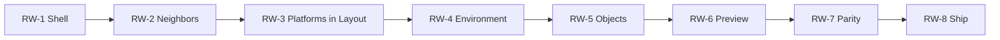

# Room wizard — implementation sprints (actionable)

This document turns [`room-creation-wizard-plan.md`](room-creation-wizard-plan.md) into **demonstrable sprints**: each sprint ends with something you can **show in a demo** or **sign off in a checklist**. Sprint ids use **RW-1 … RW-n** (Room Wizard) to avoid confusion with [`room-editor-agent-task-spec.md`](room-editor-agent-task-spec.md) Sprints 1–4.

**Rules**

- **No skip wizard** for new rooms; **Add Room** enters the wizard.
- **Single file** `room-layout-editor.html` for UI unless a small shared module is extracted (same pattern as `room-layout-export-package.js`).
- After each sprint: update `tests/test_report.md`, run existing unit tests, add tests for new pure logic, commit, push (per repository Cursor rules).

---

## Sprint overview

| Sprint | Codename | Demo outcome (one sentence) |
|--------|----------|-------------------------------|
| **RW-1** | Vertical slice | Add Room → phase rail → Layout fields → Review → **Export JSON** works. |
| **RW-2** | Neighbors | Layout includes **adjoining room**, **align**, **hatch height**; data visible on global map. |
| **RW-3** | Platforms | **Layout** phase includes **rect** platforms (Arcade-friendly), **preset library**, duplicate/mirror, **door warnings**; visible in Room view (no separate Terrain step). |
| **RW-4** | Environment | **Environment** phase applies **tags / theme** to room; persisted in JSON. |
| **RW-4b** | Environment Copilot | **AI-assisted** mood (plain language → structured `theme`/`tags` and optional render recipe); **approve before apply**; no runtime LLM in the game. |
| **RW-5** | Objects & assets | **Objects** phase: place core entities + **local asset import** stub. |
| **RW-6** | Preview | **Per-tab preview** + **placeholder player** movement (separate from main canvas). |
| **RW-7** | Flight-deck parity | **Locked steps**, **blocking reasons**, **progress** string; sprite-style UX. |
| **RW-8** | Workbench & polish | **Asset Workbench sync** when API exists; else **docs + spec + hardening**. |

**Suggested order:** RW-1 → RW-2 → … linear. RW-8 can split: **RW-8a** polish always; **RW-8b** sync when unblocked.

---

## RW-1 — Vertical slice (shell + Layout + Review)

**Goal:** Prove the product loop: **Add Room** opens the wizard, user completes **Layout** and **Review & Export**, downloads layout without touching Advanced JSON.

### Deliverables

1. **Wizard shell** — Full-width or overlay panel inside `room-layout-editor.html`; `role="dialog"`, focus trap, Esc/close behavior defined.
2. **Phase rail** — Four labels: **Layout | Environment | Objects | Review & Export**; **Layout** and **Review** active; **Environment** and **Objects** locked (disabled + tooltip “Coming in a later update” until RW-4+).
3. **Add Room** — Intercepts current `addRoom()` flow: **always** opens wizard for the new room (room row may be created first with defaults, then wizard edits that room).
4. **Layout phase (minimal)** — Fields: display name, room id (auto-suggest `nextRoomId()`), footprint preset (small/medium/large) **or** width×height; writes to **current room** in `state.data`.
5. **Review phase** — Plain-language summary; **`validateLayout`** results; buttons: **Export JSON**, **Export runtime**, **Open game** (reuse existing handlers); link to validation panel.
6. **Dirty state** — Wizard edits mark layout dirty; closing wizard returns to main editor with room selected.

### Tasks (checklist)

- [x] Introduce `state.roomWizard`: `{ active, phase, roomId, touched }` (+ `room-layout-wizard-footprint.js` for axis-aligned footprint).
- [x] Wire `#addRoom` → `openRoomWizard()` after `addRoom()` creates room.
- [x] Build phase rail component (HTML + CSS matching editor tokens).
- [x] Implement Layout panel markup + bind to wizard room.
- [x] Implement Review panel + `validateLayout`, `downloadJson`, `downloadExportPackage`, `openGameWithLayout`.
- [x] Lock Environment / Objects with disabled + title tooltip (terrain tools live under Layout after RW-3).
- [x] Confirm on close when `roomWizard.touched` (after user edits in wizard).

### Demo script (5 min)

1. Open `room-layout-editor.html` (local server if needed).
2. Click **+ Add Room** → wizard appears with **Layout** selected.
3. Change room display name, pick footprint preset.
4. Click **Review & Export** → see validation summary.
5. Click **Export JSON** → file downloads; open file and show `rooms` contains new room.
6. Close wizard → main canvas shows new room in selector.

### Definition of done

- [ ] Demo script passes without console errors.
- [ ] No regression: existing rooms still load; **Add Room** without wizard is **not** available (wizard is mandatory for new room).
- [ ] `tests/test_report.md` updated; unit tests green.

### Out of scope

- Neighbor alignment, terrain, preview, asset import.

---

## RW-2 — Neighbors & alignment (Layout complete)

**Goal:** Layout phase matches product spec: **adjoining room**, **align**, **corridor/hatch height** on the connecting edge.

### Deliverables

1. **Adjoining room** — Dropdown of other rooms (exclude current); optional “none yet.”
2. **Align with neighbor** — Action applies **snap** of `global` (and optionally suggests edge link) so shared boundaries line up; uses existing global map math where possible.
3. **Match opening height** — Control to align **door Y** or **platform floor** at threshold with neighbor’s matching edge (exact behavior depends on edge index selection — minimum: pick **edge** on each room for the connection).
4. **Global map** — After wizard actions, switching to **Global Map** shows consistent positions/links (same `state.data`).

### Tasks

- [x] UI: adjoining room, edge pickers (or simplified), align button, height match.
- [x] Implement `computeAlignedGlobal` / `computeHatchHeightDelta` in `room-wizard-neighbor-align.js` + tests.
- [x] Persist `edgeLinks` / `global` updates; run `validateLayout` after apply.
- [x] Document edge cases (no neighbor, single room in project) in UI copy.

### Demo script

1. Project with ≥2 rooms; add third via wizard.
2. In Layout, pick **adjoining room** = existing room; **Align** → global map shows rooms flush.
3. **Match hatch height** → door/platform Y consistent at threshold (show in Room view + inspector).

### Definition of done

- [ ] Demo script passes; L1 passes for linked rooms.
- [ ] New unit tests for alignment helpers.

### Out of scope

- Standalone terrain phase (merged into Layout); preview.

---

## RW-3 — Platforms in Layout (axis-aligned)

**Goal (locked):** **Rect-only** walkable surfaces for **Phaser Arcade** alignment; **minimal preset library**; **no** arbitrary polygon floors in this sprint (see project discussion). Technical copy in UI.

### Deliverables

1. When Layout is complete (`isLayoutCompleteForTerrain(room)` — non-empty name, `R#` id, size ≥ 320×320, polygon ≥ 3 vertices), **enable** preset / duplicate / mirror controls in the **Layout** sheet (`room-wizard-terrain.js`).
2. **Preset library** (**ground band**, **two levels**, **step up**, **ledge pair**, **island**) **appends** platforms inside footprint; **Duplicate** / **Mirror**; canvas **Add Platform** + editor **snap** (no numeric placement / import in v1).
3. **Warnings:** door anchor overlapping platform top band (in-wizard list); full **validateLayout** still in Review.
4. All edits are existing **`platforms`** `{ id, x, y, len, tint }` on the room.

### Tasks

- [x] `isLayoutCompleteForTerrain` + `buildTerrainPresetPlatforms` + `doorPlatformOverlapWarnings` in `room-wizard-terrain.js` + `tests/room-wizard-terrain.test.js`.
- [x] Platform tools in `room-layout-editor.html` Layout panel (merged from former Terrain tab); controls disabled until layout complete.
- [ ] Optional follow-up: height histogram; stronger “inside footprint” checks on canvas place.

### Demo script

1. Complete Layout fields → preset buttons unlock.
2. Apply **Two levels** preset → two platforms at different Y in Room view.
3. **Review** → validation unchanged; door/platform warnings show if door sits in platform band.

### Definition of done

- [x] Presets append rects; duplicate/mirror respect snap / room center; tests green.

### Out of scope (RW-3)

- Arbitrary polygon walk meshes; Phaser Matter migration; asset import.

---

## RW-4 — Environment phase

**Goal:** **Environment** tab sets **look & feel** tags / theme for the room; data persists for export.

### Deliverables

1. Unlock **Environment** after Layout is satisfiable for gameplay (product decision: default **after** platform placement is “good enough” or skip).
2. Fields: theme tags, optional swatches, optional `meta`-level vs **room-level** theme field (extend JSON schema in one place; document in `room-layout-export-package.js` if needed).
3. **Review** shows environment summary.

### Tasks

- [x] `room.environment` object `{ version, themeId, tags[] }` — `room-wizard-environment.js` + wizard Environment phase.
- [x] UI: theme preset `<select>`, comma-separated tags; unlock when layout complete (same gate as platform tools).
- [x] Export: `buildRuntimeRoom` + `worldGraph.rooms[]` include normalized `environment` (`room-layout-export-package.js`).

### Demo script

1. Set theme “cave” → export runtime → room file contains `environment`.
2. Reload editor → theme still visible in wizard Review.

### Definition of done

- [x] Schema in export helpers; unit tests green.

---

## RW-4b — Environment Copilot (AI-assisted authoring)

**Goal:** Let **solo, entry-level** authors describe a room’s mood in **plain language**; an **LLM (or local model) returns structured JSON** that maps to **existing** `room.environment` (and optionally a small `environment.render` or `environment.copilot` blob). The **dev never has to edit raw schema** unless they choose to. **Product = the tool** — complexity stays in advanced panels and export.

### Deliverables

1. **Editor UI** — In **Environment** phase: short prompt (“Describe this room’s atmosphere”), **Generate** / **Apply** / **Discard**; show a **human-readable preview** before writing to the room.
2. **Backend** — Call an LLM API **from the local layout server** (Gemini via `POST /api/copilot`, key in `.env.local`); editor uses `fetch` to same origin; **never** call from `index.html` gameplay at runtime.
3. **Output contract** — Model returns **validated JSON** (theme preset id, tags array, optional numeric recipe for future Phaser layers). Merge into `room.environment` on Apply.
4. **Safety** — No auto-apply without click; **Undo** uses existing dirty/layout history if possible, else re-sync from last save.

### Tasks (checklist)

- [x] Prompt + system message (dark fantasy metroidvania; JSON-only `themeId` / `tags` / `rationale` in `scripts/room_layout_copilot.py`, served by `sprite_workbench_server.py`).
- [x] `.env.local` + `GEMINI_API_KEY` (optional `GEMINI_MODEL`); documented in `README.md` and `.env.local.example`.
- [x] `room-layout-editor.html` + `room-wizard-environment-copilot.js` (normalize + apply).
- [x] Tests: `tests/room-wizard-environment-copilot.test.js`.

### Out of scope (RW-4b v1)

- Image generation / SD pipeline; **runtime** LLM calls; **mandatory** Copilot (manual theme/tags always work without AI).

---

## RW-5 — Objects & assets (import)

**Goal:** **Objects** phase for doors, keys, movers, etc., plus **local asset import** (paths or embedded refs); **stub** for future Asset Workbench **sync**.

### Deliverables

1. Unlock **Objects** after Environment (or configurable order).
2. Guided placement flows reusing **inspector** patterns (minimal fields first).
3. **Import asset** — file picker → store reference under room or project (structure documented); **no Workbench sync** yet unless API ready.
4. Placeholder UI: “Sync from Asset Workbench (coming soon)” disabled.

### Tasks

- [ ] Define `room.assetRefs[]` or similar; document in `docs/room-editor-creative-decisions.md`.
- [ ] Wire file picker + validation (type, size limits).
- [ ] Tests for ref serialization.

### Demo script

1. Add door + key in Objects phase.
2. Import small image → appears in list / binds to prop placeholder.
3. Export JSON contains refs.

### Definition of done

- [ ] Demo passes; Workbench sync remains stub.

---

## RW-6 — Per-tab preview

**Goal:** Each **phase tab** includes a **preview panel** (not the main canvas): embedded view, **placeholder player**, move with keyboard (and touch if feasible).

### Deliverables

1. Fixed **preview** region in wizard shell; updates per phase (Layout: footprint only; Terrain: platforms; …).
2. Implementation: **iframe** `index.html#layout=…` **or** minimal embedded scene (decide in sprint; **RW-1 §10** open decision).
3. **Placeholder player** (capsule or sprite) with **move** inside room bounds.
4. Performance: throttle updates if layout JSON large.

### Tasks

- [ ] Preview component: mount, teardown, message passing if iframe.
- [ ] Hash or postMessage current room JSON to preview.
- [ ] Movement keys documented on screen.
- [ ] If agent spec blocks iframe, document **exception** in `room-editor-agent-task-spec.md` (appendix).

### Demo script

1. Open each phase tab → preview updates.
2. Move placeholder player in preview → no crash.
3. Main canvas still authoritative for editing.

### Definition of done

- [ ] Demo passes on desktop; optional mobile note in test report.

---

## RW-7 — Flight-deck parity (locking & progress)

**Goal:** Match **Sprite Workbench** feel: **step_statuses**, **blocking_reasons**, **locked** tabs, **“N/M complete”** string.

### Deliverables

1. **Prerequisite graph** — e.g. Terrain locked until Layout valid; etc.
2. **Blocking tooltips** — why a tab is locked (reuse sprite pattern).
3. **Progress** — `wizardProgressSummary(project)` analogue for room wizard.
4. **Optional persistence** — `sessionStorage` or room-scoped `wizard_state` in layout JSON (versioned).

### Tasks

- [ ] Map phases to `step_statuses` enum.
- [ ] Centralize `canEnterPhase(phase)` checks.
- [ ] UI: progress text + rail styling for complete/active/locked.

### Demo script

1. Fresh room → only Layout open.
2. Complete Layout → Terrain unlocks; others still locked until prior complete.
3. Progress reads “3/5 complete” when on Environment.

### Definition of done

- [ ] Demo script passes; UX review against sprite workbench.

---

## RW-8 — Workbench sync & hardening

**Goal:** **Asset Workbench sync** when API exists; otherwise **release hardening**: accessibility, error boundaries, docs, [`room-editor-agent-task-spec.md`](room-editor-agent-task-spec.md) **Sprint RW** verification checklist.

### Deliverables

1. **If API available:** sync asset ids from workbench project; document contract.
2. **Always:** E2E manual checklist; fix P0 bugs; update `README` / `docs/room-creation-wizard-plan.md` “shipped” table.
3. Append **Room Wizard** verification section to agent task spec (or keep in this file).

### Tasks

- [ ] Integrate sync endpoint (TBD).
- [ ] Fallback: import-only path unchanged.
- [ ] Full demo: novice path from Add Room → export runtime → open game.

### Definition of done

- [ ] Sign-off checklist complete; stakeholder demo approved.

---

## Cross-sprint dependencies

**Parallelism:** RW-6 (preview) could start after RW-2 if preview is **Layout-only** first — optional risk reduction (spike preview in parallel with RW-4).

---

## Testing strategy (all sprints)

| Layer | What |
|-------|------|
| **Unit** | Pure helpers: alignment, `buildLayoutFromWizardDraft`, phase predicates — in `tests/room-wizard-*.test.js` or `room-layout-wizard.js`. |
| **Manual** | Demo script per sprint; record for stakeholders. |
| **Regression** | Existing `game-logic.test.js`, `room-editor-export.test.js` stay green. |

---

## Documentation updates (rolling)

| When | Update |
|------|--------|
| Each sprint | `tests/test_report.md` — note manual wizard demo for sprint RW-n. |
| RW-1 done | `docs/room-creation-wizard-plan.md` §7 — replace phase table with “see room-wizard-implementation-sprints.md”. |
| RW-8 done | `docs/room-editor-agent-task-spec.md` — add **Room Wizard (RW)** verification checklist; `docs/room-editor-creative-decisions.md` — shipped phase. |

---

## References

- [`room-creation-wizard-plan.md`](room-creation-wizard-plan.md) — product vision, five phases, preview, assets.
- [`room-editor-export-package.js`](../room-layout-export-package.js) — runtime export shape.
- `tools/2d-sprite-and-animation/app/core-helpers.js` — `FLIGHTDECK_PHASES`, UX reference.
